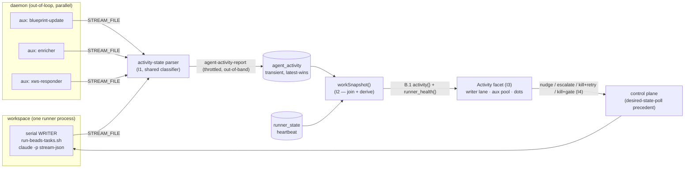

# DESIGN I — Activity, parallel runners & monitoring

> Track I of the UX v2 overhaul. The **design** deliverable behind impl beads
> I1–I5 (`claude-tools-uxvi1..5`). Owns Flow I:
> [UX-DESIGN-V2 §5](../UX-DESIGN-V2.md) (Activity view, B3/B4/B7) built on the
> [Architecture Spine](../UX-V2-ARCHITECTURE.md) contracts **A.2** (storage
> class), **B.1** (`work-snapshot` projection), **B.4** (render tolerance),
> **D.2** (closed enums + 90/180 windows).
>
> **Read the spine first.** This doc conforms to it; where it refines the spine
> (the rate-limit detector, the runner-vs-agent split) it says so and cites the
> code the refinement is grounded in. It never tightens the 90/180 windows and
> never extends the closed activity enum.

---

## 0. The one-paragraph shape

A workspace runs **exactly one serial code-writer** (the `run-beads-tasks.sh`
loop) plus **0..N read-only auxiliary agents** the daemon dispatches out-of-loop.
Each agent's `claude -p --output-format stream-json` output is classified by a
**regex/`jq` parser** (no LLM) into one of seven **derived** activity states and a
blunt liveness dot, then reported to a **transient** `agent_activity` table. A
separate, blunt **runner_health** signal describes the loop *process* itself
(alive? heartbeat fresh? starved? wedged?). `workSnapshot()` joins both into the
B.1 projection; the Activity facet renders a **writer lane** + **auxiliary pool**;
a stuck writer or wedged runner exposes four tappable actions. Nothing semantic is
asserted — every state carries `state_confidence:"derived"`.



---

## 1. The log→state parser  [I1 · claude-tools-uxvi1]

### 1.1 Where it taps and what it sees

The runner already invokes claude with `--output-format stream-json --verbose`
(`run-beads-tasks.sh:1395-1402`) and already runs a **tail-parser** over the raw
`STREAM_FILE` mktemp (`run-beads-tasks.sh:1717-1843`). That loop already does two
of the three things we need:

- writes `date +%s > "$ACTIVITY_FILE"` on **every** line — this *is* the liveness
  heartbeat the watchdog reads;
- `jq`-classifies `.type` (`assistant` / `tool_use` / `system` / `result` /
  `rate_limit_event`) and peels failure markers into `$SIGNAL_FILE`.

I1 adds the **third** thing: classify each event into the D.2 activity enum and
publish it. **It extends the existing parser in place** — it does not add a second
tail process (one consumer of `STREAM_FILE`, the parser is "already jq-heavy", per
the `td0y` note at `:1729`). v1 placement is per
[ARCH §9 decision 1](../UX-V2-ARCHITECTURE.md) (land I1 on `run-beads-tasks.sh`,
not the undeployed v2 `runner.sh`).

> **RECONCILED 2026-05-31:** the working default has FLIPPED to **v2**. Brian's
> 2026-05-30 retarget (the `v2cut` epic + the `uxhold` close) lands runner-touching
> J4/I1/I5 on **`runner.sh` (v2), gated behind `v2c3`** — do **not** patch the live
> v1 loop. `uxvi1` is gated on the v2 cutover for exactly this reason. Final
> v1-vs-v2 confirm is tracked in `uxdec` (deferred 2026-06-02); build on v2 unless
> it resolves otherwise.

The event shapes, gap percentiles, and the recommended regex set are already
measured and preserved in `tmp/beads-log-visibility-findings.md` (the §9.7
companion). **Don't re-derive them.** Key facts that shape the design:

- Liveness/stuck detection is **regex-parseable; no LLM** (findings TL;DR).
- Tool names live as `"name": "<Tool>"` inside `assistant` content blocks (the
  histogram: Bash ~58%, Edit, Read, Write, Grep, Glob…), *not* reliably at the
  top-level `type:"tool_use"` the current `:1744` branch reads — the classifier
  must read tool-use names from `assistant` message content
  (`.message.content[]? | select(.type=="tool_use") | .name`).
- Legitimate intra-task silence regularly hits 100–700s (model thinking after a
  `tool_result`). **This is why 60s false-fires ~56× and 90/180 is the floor.**

### 1.2 The classifier: derive one enum value + a liveness dot

Activity state is **closed** (D.2 [spine] — do not extend) and always carries
`state_confidence:"derived"`:

`writing-code | running-tests | exploring | thinking | waiting-on-you | rate-limited | maybe-stuck`

Derivation is **silence-gated first, then event-keyed** — silence wins because a
stale "writing-code" must never outlive the agent that stopped:

| Precedence | Condition (`Δ = now − last_event_ts`) | State |
|---|---|---|
| 1 | last tool-use is the **ask-brian MCP** call with no result yet | `waiting-on-you` |
| 2 | a **real 429** in flight (see §1.3) | `rate-limited` |
| 3 | `Δ > 180s` | `maybe-stuck` |
| 4 | `Δ ∈ [90s,180s]` | `thinking` |
| 5 | last tool-use ∈ `Edit / Write / MultiEdit` | `writing-code` |
| 6 | last tool-use is `Bash` matching a **test runner** | `running-tests` |
| 7 | last tool-use ∈ `Read / Grep / Glob` (or Bash read-utils) | `exploring` |
| 8 | otherwise (recent non-tool assistant text) | `thinking` (soft) |

**Liveness dot** is separate and blunt (D.2): `green <90s · amber 90–180s ·
red >180s`. It is computed from the heartbeat alone — never overridden by a state
guess — so the dot stays honest even if the regex set misses a new tool.

**The 90/180 numbers are [spine]; the detector set is [free]** (ARCH §8: "start
with the D.2 mapping; add patterns freely — the enum is fixed, the detectors that
feed it are not"). The test-runner Bash patterns and the read-util list grow
freely. **Do not tighten 90/180 without re-measuring** (must-protect #8).

### 1.3 Two detector refinements (grounded in existing code, enum unchanged)

D.2's *mapping basis* is coarse in two spots the runner already classifies more
correctly. We follow the runner's existing, sharper signal — the **enum is
untouched**, only the detector feeding it is refined ([free] per §8):

1. **`rate-limited` ← the real 429, not subscription telemetry.** D.2's basis
   says "`rate_limit_event` → rate-limited", but `run-beads-tasks.sh:1809-1835`
   (`t5k`) establishes that `rate_limit_event` is *5h/7d subscription-window
   metadata* (`status:allowed|allowed_warning`), **not** a throttle. The real 429
   is `system.api_retry.error=rate_limit` (already turned into `RATE_LIMIT=` in
   `$SIGNAL_FILE` at `:1757`). So map `rate-limited` from **(a)** an in-flight
   `api_retry rate_limit` storm and **(b)** `rate_limit_event` with
   `status:rejected|exceeded` only. Benign `allowed`/`allowed_warning` events are
   *not* rate-limited — surface them as runner_health quota telemetry (§3), never
   as a red agent state. (Open follow-up `claude-tools-kct` may add nuance; this
   is forward-compatible with it.)

2. **`waiting-on-you` must suppress `maybe-stuck`.** An agent blocked in an
   ask-brian MCP call legitimately emits no events for far longer than 180s. The
   precedence table puts `waiting-on-you` **above** the silence gate so a blocked
   human-decision never renders red — the same correctness move the watchdog
   already makes for in-flight Task subagents (`idg`, `:1763-1783`,
   `TASK_INFLIGHT_FILE` stretches `IDLE_TIMEOUT`). The detector keys on the
   ask-brian MCP tool-use `name` with no matching `tool_result`.

### 1.4 Publishing — cheap, out-of-band, latest-wins

**Storage class = transient** `agent_activity` table (ARCH A.2 row: "Ephemeral
telemetry, aggregation-only read", `machine_state_reports` precedent). It bypasses
`_writeRecord`/the §4 registry and is **structurally absent** from notification
bodies — it must never page anyone by itself. Op name (A.4): **`agent-activity-report`**.

The hot parser loop must **not** block on the network. Mirror the existing
`ACTIVITY_FILE`/`SIGNAL_FILE` pattern: the parser writes the derived state to a
local `ACTIVITY_STATE_FILE`; a **separate throttled reporter** (fold into the
existing 15s watchdog cadence at `:1857-1958`, or a sibling ticker) POSTs
`agent-activity-report` on **state transitions** and on a freshness heartbeat
(≤60s) so liveness stays current during a long single-state stretch. Report body:

```jsonc
{ "workspace": "rhythmGame", "agent_key": "writer:<runner_id>",   // latest-wins key
  "lane": "writer|auxiliary", "kind": "impl|blueprint-update|enricher|xws-responder|tests-readonly|docs",
  "bead_ref": "rhythmGame-93o", "title": "…", "stage": "impl",
  "state": "writing-code", "state_confidence": "derived",         // always; never "asserted"
  "liveness_dot": "green|amber|red", "last_event_ts": "…", "seconds_in_state": 132,
  "current_tool": "Edit", "touching": ["Gameplay","Input"] }      // touching = [free] stretch, §1.5
```

`agent_key`: the **writer** is `writer:<runner_id>` (one per workspace — singular
by construction, §4); an **aux** is `aux:<kind>:<dispatch_id>` (the daemon's pid /
marker key, §5).

**This body is the transient-table *ingest* schema — a superset shared on the
wire by both lanes — NOT the projection the UI reads.** `workSnapshot()` (I2)
projects each lane **down to its exact B.1 shape**, and I3 reads **only those**
(must-protect #2, the 56h projection-drop guard): the **writer** projects to B.1's
`{bead_ref, title, stage, state, state_confidence, liveness_dot, seconds_in_state,
touching}`; the **aux** projects to the narrower B.1 `{kind, label, state,
state_confidence, liveness_dot}` — an aux carries **no** `bead_ref`/`title`/
`seconds_in_state` to the UI. `current_tool` and `last_event_ts` are **table-only
telemetry** (debug/derivation inputs) and are **not** in B.1 for either lane —
`workSnapshot()` consumes them to derive `state`/`liveness_dot` but never surfaces
the raw tool name. If a future view needs a key, it is **added to B.1 first**, then
emitted — never read off the table directly.

> **IMPLEMENTED (uxvi1, 2026-06-02).** The reporter is **`lib/activity-report.sh`**
> — a sourceable companion to the pure `lib/activity-classifier.sh`: it extracts
> the classifier's input facts (last tool from assistant **content** blocks, the
> ask-brian-MCP-in-flight + real-429 overrides) from the worker's stream-json
> capture, classifies, writes a local `ACTIVITY_STATE_FILE`, and **throttled +
> backgrounded** POSTs `agent-activity-report`. **v2 reality:** `runner.sh` has
> **no `tail -f` parser** (it closed the BC-39/40 leak), so the reporter is POLLED
> on the `st_run_task` during-task control cadence (`ACTIVITY_REPORT_INTERVAL`,
> the heartbeat-beat sibling ticker) — **that** is the §1.4 "separate throttled
> reporter, not in the hot loop", not a second tail process. The engine op is
> **`cf/src/activity.js`** (`agent_activity` transient, latest-wins per
> `agent_key`, the `machine-state.js` precedent). Both are factored as the shared
> seam I5 reuses on the daemon's aux streams. Engine+runner live-verified against
> the deployed Worker (a writer report round-trips with `principal:"brian"`).

### 1.5 `touching[]` (writer only, [free] stretch)

For the Blueprint overlay, the writer report may carry the domain ids it is
editing — derived by mapping edited file paths (the `Edit`/`Write` targets the
parser already sees) onto the Blueprint's `derived` node domains (Track H). This
is best-effort and degradable: absent → `[]`, never blocks a report.

---

## 2. Writer lane + auxiliary pool — the model  [feeds I3 · claude-tools-uxvi3]

Per UX-DESIGN-V2 §5.1. The distinction the UI draws is **write-capability**,
because that is the only thing that can conflict in the working tree.

- **Writer lane — exactly one, by construction.** There is one
  `run-beads-tasks.sh` loop per workspace; it works beads strictly serially. B.1
  models this as `activity.writer` = one object **or `null`**. The singularity is
  *structural* (one serial loop), reinforced by the per-task lease (BC-04 "exactly
  one owner", `coordinator.sh:1636-1643`, consulted on every pickup via
  `lease_acquire_ok` `run-beads-tasks.sh:1447`) which additionally stops a second
  *machine* double-claiming the same bead. There is no path today that runs two
  writers in one workspace, and I-track adds none.
- **Auxiliary pool — 0..N, read-only by construction.** Blueprint-updaters,
  enrichers, cross-workspace responders, doc agents, test-only runs that don't
  edit source. B.1 `activity.auxiliary[]`. They run in **parallel** with the
  writer because they cannot touch the tree (§5 read-only hats). An aux that needs
  to write code does **not** belong in the pool — it becomes a bead for the writer
  lane (must-protect #11; UX-DESIGN-V2 §5.1).

The UI makes the "serial — exactly one" constraint obvious (UX-DESIGN-V2 §5.1
mock). I3 renders writer-lane + aux-pool + per-agent liveness dots straight from
B.1 — it reads only keys B.1 promises (must-protect #2), and degrades per-field
(B.4): a missing/stale `activity` block renders an honest placeholder
(`writer:null` or a dot from heartbeat age) + a `degraded[]` note, **never** a
throw or a blank (4xe / inbox-renderer tolerance — never re-add a render refusal).

---

## 3. runner_health ≠ agent activity  [§5.4 · feeds I2 · claude-tools-uxvi2]

Brian called out "the **script** gets stuck" separately from "an **agent** gets
stuck" (UX-DESIGN-V2 §5.4). They are two different signals and must not collapse:

- **agent activity** (§1) = derived from a *worker's log stream*. "Is this claude
  alive, what tool is it running, is it stuck?"
- **runner_health** = the *loop process* itself, blunt and not log-derived. B.1
  shape: `{ process: alive|dead, heartbeat: fresh|stale, last_pickup_at, state }`.

`runner_health.state` is the closed set `working | idle | starved | wedged`,
derived in `workSnapshot()` (I2) from `runner_state` heartbeat age + pickup
recency + the skip-loop shape:

| state | Means | Derived from |
|---|---|---|
| **working** | in a task; writer present, events fresh | live writer + fresh heartbeat |
| **idle** | alive, looping, nothing to do, **or in a deliberate backoff** | fresh heartbeat, no writer; incl. usage-cooldown / capacity-deny / skip-backoff |
| **starved** | alive but the ready set is *only un-workable* beads (epic-skip) | the `g20`/`dzc` heartbeat-idle shape (`run-beads-tasks.sh:~1408` validate-skip loop) |
| **wedged** | process alive but heartbeat **stale** and **not** in a known backoff | stale `runner_state` age + absence of a backoff marker (the `krxv`/`td0y` claude-won't-exit wedge) |

**This is the resolution of the findings' hard point:** a 30-min
`USAGE_SLEEP_SECONDS` cooldown or a 60s `CAPACITY_DENY_BACKOFF` must **not** read
as stuck (findings §180–182). They are *healthy-but-waiting* → `runner_health.state
= idle` with a reason string (and the quota telemetry from §1.3), **never** agent
`maybe-stuck` and **never** `wedged`. Only a stale heartbeat with no backoff marker
is `wedged`. A starved-but-alive runner reads `idle`/`starved`, never `stuck`
(UX-DESIGN-V2 §5.4 verbatim).

Both `runner_health` and `activity` are **named sub-objects** on `projects[]`
(ARCH §6: each track owns a sub-object to avoid `workSnapshot()` merge collisions)
— Track I owns `activity` **and** `runner_health`; do not flatten either into
loose keys.

---

## 4. Stuck must be visible AND actionable  [§5.3 · I4 · claude-tools-uxvi4]

When a writer goes `maybe-stuck` (red) or the runner goes `wedged`, it surfaces
loudest-first in three places: the Activity card (⚠), the Workspace card health
pip, and — only if it crosses the failure→tier mapping — the Inbox (UX-DESIGN-V2
§5.3). The runner's watchdog already *watches* autonomously; **the new part is GUI
surfacing + making the four actions tappable instead of ssh-only.**

| Action | What it does | Reversible? | Wires to |
|---|---|---|---|
| **Nudge** | veto the watchdog's pending kill for one more soft window (and, where a live control channel exists, send *continue*) — poke, don't terminate | yes — pure grace extension | watchdog grace (`:1857-1958`) |
| **Escalate to decision** | convert the stuck task into a Flow B **dossier** (reuses the v1 "intervene in a running task" reframe); the Inbox then drives it | yes — dossier is ephemeral | dossier op (Inbox) |
| **Kill + retry** | terminate the worker (existing SIGINT→SIGKILL watchdog path) and let the loop **re-dispatch a fresh worker** on the same bead | partly — work lost, bead intact | retry loop |
| **Kill + Gate** | terminate **and** place a `gate:<id>` (Track J) with a reason, so the bead stops being retried until the gate lifts | yes — lift the gate | `agent-action gate-apply` (label) + worker-kill + J4 runner-respect; why/unblock via `gate-meta-set` |

A fifth action — **Attach** (tmux/ssh live take-over, UX-DESIGN-V2 §5.3) — is
**deferred** ("secondary, later" in the source; v1 §7 deferred). Not in I4's
scope; named here only so the omission is deliberate, not a gap.

**Routing — through the control plane, not a direct web→process kill.** The web
tier never signals a process directly (Local==remote; the web side holds no host
access). An action POSTs an **intent** that the daemon reconciles out-of-band,
exactly like the existing **desired-state-poll** flips `desired=running|stopped`.
The op is **frozen in [agent-action.md](agent-action.md)** (`claude-tools-uxcap`):
**`agent-action(intent, target, args)`** with the **closed, host-effecting** enum
`nudge | kill-retry | kill-gate | gate-apply | gate-lift`, enqueued into a transient
`agent_actions` queue and executed by the daemon's `agent-action-poll.sh`. I4 wires
its three buttons to `intent ∈ {nudge, kill-retry, kill-gate}` (each reuses the
watchdog kill-path at `:1857-1958` via a control marker the runner honors — the §4
runner-side seam). **Escalate is NOT an agent-action** — it creates a Flow B
dossier (a pure engine write, no host effect) via the existing dossier op, per the
§4 action table above. (Kill+Gate places the gate **first** via `gate-defer.sh
apply` so J4's `gate:*` pickup-refusal then suppresses re-dispatch — the
runner-respect Track J defines; production-runner placement per ARCH §9 decision 1.
The gate's why/unblock is `gate-meta-set` — engine-direct, not part of the action.)

**Must-protect #12 (Fix-B over-trigger):** kill+retry re-dispatch keys on the
`STUCK_NEEDS_HUMAN` predicate; tighten that match to a **recent window**, not
"anywhere in notes", so a once-stuck bead doesn't auto-loop forever (HANDOFF loose
thread). I4 owns this tightening.

I4 is a **web + runner** bead and is **not done until the deployed Pages site
serves the new bytes** (CLAUDE.md web-track discipline / claude-tools-bgw):
`wrangler pages deploy … --project-name claude-wrangler` then
`verify-pages-deploy.sh` → `mismatches=0`, and a live runner honors a real
`agent-action`. Local-green + committed is not acceptance.

---

## 5. Parallel auxiliary dispatch — daemon-driven, no runner rewrite  [§5.1 + ARCH §9.1 · I5 · claude-tools-uxvi5]

**The recommendation (ARCH §9 decision 1, the architect's call):** keep parallel
aux dispatch in the **daemon**, which *already* dispatches read-only hats
out-of-loop — **no runner rewrite, no v2 cutover.** I5 generalizes the pattern the
daemon already runs in three places:

| Existing precedent | File | Dispatch | Hat |
|---|---|---|---|
| M6 bd-surgery reconciler | `daemon/m6-dispatch.sh:175-189` | **detached** `nohup … & ; disown` — concurrent with the serial runner | `reconciler.system.md` |
| Intake enricher | `daemon/intake-dispatch-poll.sh:342-346` | synchronous (awaits stdout) | `enricher.system.md` |
| Flow-F overview | `daemon/flow-f-overview-poll.sh:388-392` | synchronous | `dossier-builder.system.md` |

I5 spawns the Activity-pool aux kinds — **blueprint-update** (Track H5) and
**enricher** (carried) — using the **M6
detached pattern** (`nohup … & ; disown`) so they run **truly in parallel** with
the serial writer and with each other, and so they show up live in the aux pool.

> **RECONCILED 2026-05-31:** the **xws-responder** is NO LONGER spawned by I5.
> The cross-WS responder spawn-owner was resolved to **K1** (`uxvk1`, MCP-spawned on
> the blocking ask-workspace path); I5 drops it from its spawn list. The
> `xws-responder` value in the §1.4 enum stays valid (it still appears in the aux
> pool when K1 spawns it) — Track I just does not dispatch it.

Each aux dispatch:

1. **Read-only by construction** (must-protect #11). The hat permission set in
   `agents/specialist.sh:152-205` already enforces this defense-in-depth:
   `ALLOWED = Read Grep Glob LS Bash(bd:*) Bash(git:*)` + read-utils;
   `DISALLOWED = NO_CODE_EDITS = Write Edit MultiEdit NotebookEdit BashWriteEdits`
   (`:137-138`), **plus** the hat prompt ("the only side effect you produce is
   `bd` calls; you do not write code" — `reconciler.system.md:1`,
   `enricher.system.md:3`). An aux **cannot** mutate the tree.
2. **Single-flight per `(workspace, kind)`** — reuse the existing idempotency
   guards (m6 pidfile `daemon_m6_already_in_flight` `:81-93`; flow-f marker files
   `:38-45`) so two of the same aux never run at once.
3. **Does not take the writer lease** — it isn't claiming a writer bead, so the
   writer's singularity is unaffected. The writer lane keeps its one-at-a-time
   loop **untouched** (this is the whole point of "no runner rewrite").
4. **Reports activity** via the shared §1 classifier so it appears in
   `activity.auxiliary[]`. → factor I1's classifier into a **sourceable shared
   function** (e.g. `lib/activity-classify.sh`) consumed by both the runner's
   writer stream and the daemon's aux streams, so one enum/threshold definition
   feeds the whole table.

**Capacity:** aux dispatches consult the same machine-wide capacity the daemon
already publishes (`usage-poll.sh` → `capacity.json`) so a parallel pool can't
blow the 5h/7d budget; gate aux spawns on a cheaper cost-class than the writer.

> **BUILT — the gate (I5-cap · claude-tools-pof7):** `daemon/aux-dispatch-gate.sh`
> (sourced by `daemon.sh`). I5 MUST route every aux spawn through it:
> - detached (`nohup … & ; disown`) block: `if daemon_aux_capacity_ok; then nohup … & disown; else log "$AUX_GATE_REASON"; fi`
> - synchronous dispatch: `daemon_aux_dispatch_guard <kind> <cmd…>` (runs the cmd iff allowed)
>
> The gate reads `capacity.json` directly (same 2× `USAGE_CACHE_SECONDS` staleness
> contract as `la__capacity_via_daemon`) and tests membership of the **cheaper
> `low_priority`** cost-class — `usage-poll.sh` drops `low_priority` from
> `allowed_cost_classes` (spare-cycles ramp) **before** it drops the writer's
> `standard` (hard ceiling), so the aux pool is the first lane suppressed as
> budget tightens and the last to resume. **Fail-OPEN** on a missing/stale/
> unparseable signal (BC-34 §6.2): the daemon is the cache PRODUCER, so an absent
> signal is transient + self-healing, and the gate is never stricter-on-
> uncertainty than the writer it shadows. `AUX_GATE_REASON` carries the §6.3 WHY
> for the log line. Pure read — no §4 record, no transient table (Contract A.2).

**The open decision this rests on:** ARCH §9 decision 1 (v1 vs v2 runner
placement) is **Brian's yes/no** and is *already filed there* as the one open item
that blocks an impl bead. I5's bead (`uxvi5`) carries "Confirm w/ Brian". This
design assumes the architect's recommendation (daemon + v1) and is structured so
that if Brian says "v2 instead", only the *placement* of I1's parser moves — the
classifier, enum, table, projection, and aux pattern are placement-independent.
**Not re-litigated here** (it has a filed home and a recommended answer); flagged
as the single dependency.

---

## 6. Contract conformance checklist (the must-protect lens)

| Spine item | How Track I conforms |
|---|---|
| **A.2** storage class | `agent_activity` = **transient** (telemetry, latest-wins, `machine_state_reports` precedent); absent from notification bodies |
| **A.3** projection-field rule | `activity{}` + `runner_health{}` derived/joined **in `workSnapshot()`**; UI reads only what B.1 promises |
| **B.1** projection shape | emits `activity.writer` (one\|null, 8-key), `activity.auxiliary[]` (narrower 5-key), `runner_health{process,heartbeat,last_pickup_at,state}` verbatim; ingest superset projected **down** to these, UI reads only these (§1.4) |
| **B.4** tolerance | every Activity field degrades to an honest placeholder + `degraded[]`; the only refusal is the integer schema-gate |
| **D.2** closed enum | 7 activity states **unchanged**; `state_confidence` always `"derived"`; runner_health state set `working\|idle\|starved\|wedged` |
| **D.2** 90/180 windows | **[spine] — not tightened.** Silence gate is 90 soft / 180 hard; only detectors are [free] |
| must-protect #7 honesty | "looks like running tests"; never an asserted semantic claim |
| must-protect #8 windows | not tightened; cited measurement (60s false-fires ~56×) |
| must-protect #11 aux read-only | enforced by `specialist.sh` permission set **+** hat prompt |
| must-protect #12 Fix-B | I4 tightens `STUCK_NEEDS_HUMAN` to a recent window |
| bgw web-track | I3/I4 close only on a verified Pages deploy (`mismatches=0`) |

---

## 7. Impl split — beads I1–I5

The impl beads already exist under epic `claude-tools-mhcp`; this doc is their
design of record. Pointers below are the design anchor for each.

| Bead | Scope | Design anchor | Track-type / gate |
|---|---|---|---|
| **I1** `uxvi1` | activity-state log parser → `agent_activity` transient (`agent-activity-report`) | §1 | runner; live-verify engine+runner |
| **I2** `uxvi2` | `activity{}` + `runner_health{}` in `workSnapshot()` | §2 (lanes) + §3 (health) | engine (Contract B.1) |
| **I3** `uxvi3` | Activity facet UI: writer lane + aux pool + liveness dots | §2 + §6 tolerance | **web** (Contract C/D.2) — Pages-verify |
| **I4** `uxvi4` | stuck actions tappable: nudge / escalate / kill+retry / kill+gate | §4 | **web + runner** — Pages-verify; ties J1 |
| **I5** `uxvi5` | parallel aux dispatch (daemon spawns read-only aux alongside serial writer) | §5 | daemon; **depends ARCH §9 dec.1** |

**Dependency notes.** I2 ⟶ I1 (needs the table); I3 ⟶ I2 + `C-shell`
(`claude-tools-uxvsh`, all facet UIs are `--blocked-by C-shell`); I4 ⟶ I3 + J1
(kill+gate needs `gate_metadata`); I5 ⟶ ARCH §9 decision 1 (Brian's yes/no, the
one genuine fork — already filed in the spine, not re-asked here). I1's classifier
is the shared seam I5 reuses (§5.4 sourceable lib), so build I1 before I5.

---

## 8. What's deliberately [free]

Per ARCH §8 — move fast, these don't couple to another agent once the enum +
90/180 + B.1 shape hold: the **detector regex set** (test-runner Bash patterns,
read-util list, new tool names); Activity card **layout / icons / density** inside
Contract C's tokens; the aux-pool sort order; the reporter **throttle cadence**
(any value that keeps liveness fresh ≤ the 90s soft window); the `touching[]`
path→domain mapping heuristic; op/table **names within the flow** before it ships.
