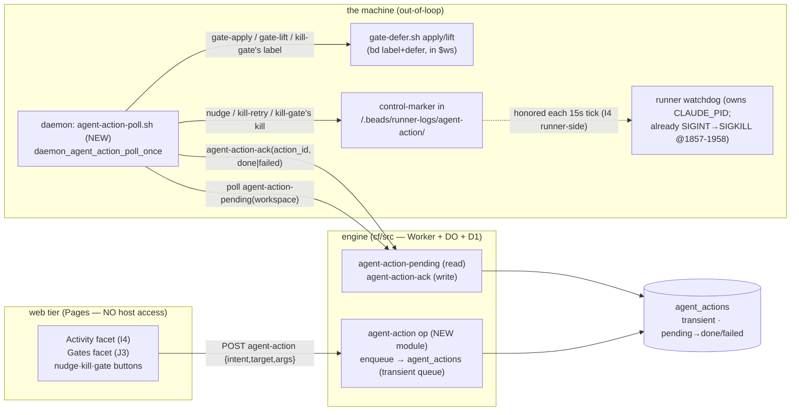

# DESIGN — Control-plane `agent-action` (the host-side executor)

> The **shared control-plane substrate** behind two impl beads that both need to
> cause **host-side effects from the web tier**: I4 (`claude-tools-uxvi4`, stuck
> actions: nudge / kill+retry / kill+gate) and J3 (`claude-tools-uxvj3`, Gates
> facet: add / lift a gate). Reconciles **R-J1 + R-I1** (the design audit):
> [activity.md §4](activity.md) named `agent-action` only as **RECOMMENDED** and
> [gates.md §4](gates.md) routed lift/add "via its op surface" — **neither froze
> it**, so an impl agent would wire a button to a nonexistent endpoint. This doc
> freezes the **one engine op + the one daemon-side executor** they both call.
> Owns bead `claude-tools-uxcap`.
>
> Built on the [Architecture Spine](../UX-V2-ARCHITECTURE.md): **A.1** (the
> add-an-op checklist), **A.2** (storage class — this is a **transient** control
> queue), **A.4** (naming), and §9 decision 1 (out-of-loop placement). It changes
> no `[spine]` seam; it *adds a module + a daemon poller* per A.2's "new work adds
> modules and guards, it does not restructure the substrate."

---

## 0. The one-paragraph shape

The web tier holds **no host access** — Local==remote, the GUI is a Cloudflare
Pages site that can only POST ops to the engine (a Worker → Coordinator DO + D1).
But I4's stuck actions and J3's gate edits need **host-side effects**: signal/kill
a worker process, run `gate-defer.sh apply/lift` (a `bd` label + defer mutation in
a workspace), poke a watchdog. The engine cannot do any of these — it has no shell
on the machine. So we reuse the **exact pattern the runner-lifecycle already
runs**: the web POSTs an **intent** that the engine records, and the **daemon polls
it out-of-band and reconciles the host** — identical in shape to how `set-desired`
flips `desired=stopped` and `desired-state-poll.sh` then SIGTERMs the runner
(`daemon/desired-state-poll.sh:208-227`). One write op **`agent-action`** enqueues
a one-shot intent into a **transient `agent_actions` queue**; the daemon's new
**`agent-action-poll.sh`** reads pending intents for its registered workspaces,
performs the host effect, and acks. The intent enum is **closed and
host-effecting only** — `nudge | kill-retry | kill-gate | gate-apply | gate-lift`.
Things the web can already do against the engine itself (create a dossier for
**escalate**; `gate-meta-set` the why/unblock) are **not** agent-actions and do
**not** round-trip through the host.



---

## 1. Why this and not a direct web→process call

The web side **structurally cannot** reach the host (the bgw/2dk lesson made
literal: "Local==remote; the web side holds no host access"). Three rejected
shortcuts and why:

- **Web → process kill directly.** Impossible — the Pages function runs on
  Cloudflare, not the Mac. There is no socket from the edge to the runner.
- **Runner executes its own actions.** The single most important action is *kill a
  stuck/wedged worker* — and a wedged runner **cannot reliably act on itself**
  (that is the definition of wedged, `runner_health.state=wedged`, activity.md §3).
  The executor must be a **separate, always-alive process**. The daemon already is
  exactly that, and already owns process lifecycle (it SIGTERMs runners on
  `desired=stopped`) and workspace-scoped `bd` (it `cd`s into a workspace and reads
  `bd show` in `work-control-reconcile-poll.sh:197-205`). **The daemon is the
  executor.**
- **Make it a `set-desired`-style sticky level.** Wrong shape: `desired=stopped`
  is a *declarative level* reconciled repeatedly (idempotent, re-asserted every
  poll). An agent-action is an **imperative one-shot** (nudge *once*, kill *once*,
  lift *once*) — a sticky level would re-kill every 30s. So it is a **command
  queue**, not a desired-state. (The two also differ in *granularity*: `set-desired`
  acts on the whole **runner loop**; agent-action's kill acts on the inner
  **worker** — the stuck `claude -p` — and lets the loop survive. See §4.)

This is the same intent→record→daemon-reconciles-host arc the lifecycle already
ships; we are generalizing it from one verb (`set-desired`) to a small closed set.

---

## 2. The engine op  [storage class: transient · A.2]

### 2.1 Storage class — transient `agent_actions` queue, not a §4 record

A.2's decision rule puts this in the **transient sibling namespace**: it is a
**control/dedup row** (A.2 lists "dedup/**control rows**" and `work_plane_ops` as
the precedent), has **no owned `(type,id)` lifecycle that appears in the read
projection or a notification body**, and is **ephemeral** (a command, consumed and
discarded). It therefore **bypasses** `_writeRecord`/`validateRecord`/the
`schema.js` registry exactly like `machine_state_reports` and `capacity_reports`.

**The obvious objection — "it has a `pending→done/failed` lifecycle the daemon
mutates, isn't that a §4 record?" — and the rebuttal.** A `status` column is not a
§4 lifecycle. A.2's §4 test is *owned, addressable by `(type,id)`, versioned, and
legitimately in the projection or a notification body* — a `dossier`/`runner_state`/
`lease`. An agent-action is a **consumed command, not an owned entity**: nobody
`get`s it by id later, it is never versioned, it never appears in the read-model,
and once acked it is dead weight (a [free] GC sweeps it). Its `status` is just the
at-most-once bookkeeping every command queue needs — exactly what `work_plane_ops`
already carries as a transient. If a UI ever needs the *status* on screen, that key
goes through B.1 first (A.3) and is **derived** in `workSnapshot()`; the queue row
itself still never enters the projection. Transient is the right class.
A new module `cf/src/agent-action.js` lazy-DDLs it (the `machine-state.js:67-76`
pattern):

```sql
-- cf/src/agent-action.js — lazy DDL (machine-state.js ensureSchema pattern)
CREATE TABLE IF NOT EXISTS agent_actions (
  action_id   TEXT NOT NULL PRIMARY KEY,   -- engine-minted, opaque, idempotency key
  workspace   TEXT NOT NULL,               -- project_ref (the daemon filters on this)
  intent      TEXT NOT NULL,               -- the closed enum (§3)
  target_json TEXT NOT NULL,               -- {bead_ref?, gate_id?, bead_refs?}
  args_json   TEXT,                         -- {reason?, date?, …} intent-specific
  status      TEXT NOT NULL,               -- pending | done | failed
  owner       TEXT,                         -- "you" | "agent:<hat>" (declared, §2.4)
  requested_at TEXT NOT NULL,
  acked_at    TEXT,                          -- when the daemon reported terminal status
  result_json TEXT                          -- daemon's {ok, message} on ack
)
```

It is **structurally absent** from `workSnapshot()` (A.3) and from notification
bodies (A.2) — a control queue must never page anyone by itself. If a future UI
wants live "kill requested…" status, it is **added to B.1 first** (the A.3 rule),
then emitted; for v1 the UI reads status by polling `agent-action-pending` (or just
renders optimistically). Per A.1 step 5, ship `cf/migrations/NNNN_agent_actions.sql`
as the deploy-path source of truth even though the DO lazy-DDLs.

### 2.2 Three ops, one module, one guard  [A.1 steps 1-2]

`cf/src/agent-action.js` exports — mirroring `gate-meta.js`'s guarded-set shape
(`coordinator.js:277-279`, the `RECONCILE_OPS`/`handleReconcileOp` precedent):

```js
export const AGENT_ACTION_OPS = new Set([
  "agent-action", "agent-action-pending", "agent-action-ack",
]);
export async function handleAgentActionOp(co, op, args, principal) { … }
```

and `coordinator.js` `fetch()` gets one guard **before** the substrate switch
(keep the switch byte-stable — its differential tests must not regress):

```js
if (AGENT_ACTION_OPS.has(op)) return await handleAgentActionOp(this, op, args, principal);
```

| Op | Caller | Kind | Contract |
|---|---|---|---|
| **`agent-action(intent, target, args)`** | web / agent | **write** (enqueue) | validate `intent ∈` enum + `target.workspace` present + per-intent required fields (§3); mint `action_id`; insert `status:"pending"`; return `{ok:true, action_id}`. Reject (422, empty body — `machine-state.js:245` posture) on a bad intent or missing required field. |
| **`agent-action-pending(workspace?)`** | daemon | **read** | return the `pending` rows (optionally filtered to one `workspace`); pure read, no `_serialize`, mirrors `getMachineStates`. Empty ⇒ `{actions:[]}`, never a throw. |
| **`agent-action-ack(action_id, status, result?)`** | daemon | **write** | set `status ∈ {done,failed}` + `acked_at` + `result_json` for one `action_id`; idempotent upsert. Missing id ⇒ `{ok:false}`, never a throw. |

### 2.3 Auth — the one chokepoint, the shared principal

`agent-action` and `agent-action-ack` are **write ops** and pass the single §9.1
auth chokepoint (`index.js:35-45`) like every other write: the Worker validates the
bearer and resolves the constant `PRINCIPAL_V1(env)` **before** the op runs. The
op handler never re-derives identity.

### 2.4 `owner` is a declared input (the gates.md §2.3 move, reused)

Because the bearer is shared by the GUI proxy and every agent, the principal cannot
distinguish "you" from "agent:enricher" (gates.md §2.3, `index.js:35-45`). So
`owner` is an **explicit input** on `agent-action` — the GUI proxy passes
`owner:"you"`, an agent passes `owner:"agent:<hat>"` — the same honest
self-declaration the work plane already uses, and the same field `gate-meta-set`
carries. (Reversible: if a per-actor principal ever lands, `owner` switches to
principal-derived without a table change.)

---

## 3. The closed intent enum (host-effecting verbs only)

`intent` is a **closed set**. Each row says exactly which **host mechanism** the
daemon uses and which **existing seam** it reuses — nothing here is new ground.

> **AMENDMENT (2026-06-06, claude-tools-y6j9 — local-first desired-state):** the
> enum is widened by ONE: **`set-desired`**. This is the cloud→runner
> change-request the local-first redesign (claude-tools-dky8) needs — it COMPLETES
> the generalization §0 anticipated ("generalizing it from one verb (`set-desired`)
> to a small closed set"). It is the agent_actions INTENT, distinct from the legacy
> `set-desired` OP (`opSetDesired`/`co__set_desired`, the direct RunnerState.desired
> write the GUI keeps for display). Unlike the other intents it causes NO worker/
> watchdog host effect — the daemon writes the LOCAL `.co-store/runner_state.desired`
> (apply-local-before-ack) so the runner/daemon read it FIRST. No new §4 record, no
> DDL, no new adapter mapping (the generic `target_json`/`args_json` columns + the
> existing `agent-action` mapping carry it).

| `intent` | What the daemon does on the host | Reuses | Required `target` / `args` | Reversible? |
|---|---|---|---|---|
| **`set-desired`** | write the requested state to the LOCAL `.co-store` RunnerState (`daemon_aa_set_local_desired` → in-process `co__set_desired`); NO marker, NO gate, NO worker kill. The runner/daemon read local desired FIRST (the break-through-pause fix). | `co__set_desired` (local store write) + the daemon being the always-alive cold-start consumer | `workspace`, `args.state ∈ {running,paused,spare-cycles,stopped}` | yes (a later set-desired) |
| **`nudge`** | drop a **grace marker** in `<ws>/.beads/runner-logs/agent-action/`; the runner watchdog reads it next tick and extends its kill-grace one soft window (poke, don't terminate). v1 has no live channel into `claude -p`, so "send *continue*" is deferred (like Attach). | the file-signal idiom (`ACTIVITY_FILE`/`TASK_INFLIGHT_FILE` at `:1713-1718` already stretch the timeout) + watchdog `:1857-1958` | `workspace`, `bead_ref`; `reason?` | yes (pure grace extension) |
| **`kill-retry`** | drop a **worker-kill marker**; the watchdog (which owns `CLAUDE_PID`, spawned at `:1709`, and already does the staged SIGINT→SIGKILL at `:1953-1958`) terminates the **worker**, the loop re-dispatches a fresh worker on the **same** bead. | watchdog kill path `:1857-1958`; loop re-pickup | `workspace`, `bead_ref`; `reason?` | partly (work lost, bead intact) |
| **`kill-gate`** | **apply the gate first** (`gate-defer.sh apply` — so the label is present), **then** drop the worker-kill marker. J4's `gate:*` pickup-refusal then blocks re-dispatch, so the bead stops retrying until the gate lifts. | `gate-defer.sh apply` + watchdog kill + J4 gate-respect | `workspace`, `bead_ref`, `gate_id`, `args.date`; `reason?` | yes (lift the gate) |
| **`gate-apply`** | run `gate-defer.sh apply <gate_id> <bead> <date>` in `$ws` for each selected bead (J3 add-a-gate). **The why/unblock/scope is NOT set here** — the web sets it via `gate-meta-set` **directly against the engine** (no host needed). | `gate-defer.sh apply` (`gate-defer.sh:109-127`) | `workspace`, `gate_id`, `bead_ref` **or** `bead_refs[]`, `args.date` | yes (lift the gate) |
| **`gate-lift`** | run `gate-defer.sh lift <gate_id> --commit` in `$ws` — clears the defer **and** removes the `gate:<id>` label from the whole cohort. | `gate-defer.sh lift` (`gate-defer.sh:129-188`) | `workspace`, `gate_id` | the lift itself is the reversal of a gate |

**Two boundaries this enum deliberately draws — not gaps:**

1. **`escalate` is NOT an agent-action.** I4's fourth stuck action ("Escalate to
   decision") creates a Flow B **dossier** — a *pure engine write* the web already
   does against the existing dossier op. It needs **no host effect**, so funneling
   it through the daemon would be a pointless round-trip. activity.md §4's action
   table already wires escalate → "dossier op (Inbox)"; this freeze keeps it there
   and **removes escalate from the `agent-action` enum** (resolving the §4 prose's
   stray inclusion of it).
2. **`gate-meta-set` is NOT an agent-action.** Gate metadata (why/unblock/owner/
   scope) lives in the engine's `gate_metadata` table (gates.md §2) and is set by
   a **direct engine write**. Only the **`bd` label+defer mutation** needs the
   host. So a J3 "add gate" is **two calls**: `gate-meta-set` (engine, direct) +
   `agent-action gate-apply` (host, via the daemon). This refines activity.md §4's
   slightly-imprecise "Kill+Gate → `gate-meta-set` (J1)" — the *label* placement is
   `gate-defer.sh apply`; `gate-meta-set` only writes the annotation.

**`gate-defer.sh apply` requires a `date`** (`gate-defer.sh:110-113` — it couples
the `gate:<id>` label *with* a `bd update --defer <date>`; `lift --commit` clears
both). So `gate-apply` / `kill-gate` **must** carry `args.date`; J3/J1 choose the
date (the unblock date, or a far-future sentinel for "indefinite until lifted").
This is the existing gate mechanic surfaced, not a new one.

**Why apply-gate-before-kill is race-free.** The daemon runs `gate-defer.sh apply`
**synchronously** (the label is committed to `bd` before the executor moves on),
*then* drops the kill marker. So by the time the worker dies and the loop comes back
around to pick a bead, the `gate:<id>` label is already present and J4 refuses it.
The one thing the gate does **not** do is stop the *currently-running* worker — J4
is a **pickup-time** refusal only (gates.md §5), not a running-worker signal. That's
fine: the running worker is exactly what the kill marker terminates. So the two
mechanisms compose cleanly — the **marker** kills the in-flight worker, the **label**
suppresses the *next* pickup — with no window where a fresh worker re-claims the
gated bead.

---

## 4. The daemon-side executor  [new `daemon/agent-action-poll.sh`]

A new poller `daemon/agent-action-poll.sh` exporting
`daemon_agent_action_poll_once`, sourced and ticked in `daemon.sh`'s main loop
**exactly like** `desired-state-poll.sh` and `work-control-reconcile-poll.sh`:

- **Source** next to the others (`daemon.sh:~95-115`):
  `. "$DAEMON_DIR/agent-action-poll.sh"`.
- **Cadence** `AGENT_ACTION_POLL_INTERVAL="${BEADS_DAEMON_AGENT_ACTION_POLL_INTERVAL:-30}"`
  — **30s** (faster than `set-desired`'s 60s: these are interactive button presses,
  Brian wants the kill to land soon). [free] to tune.
- **Tick** a `_last_agent_action_poll` arm in the `while` loop, same shape as the
  other pollers; first-run-immediate (`|| [ "$_last…" -eq 0 ]`).

Per pass, for each registered workspace it `co_request … agent-action-pending
<project_ref>` (subshell-isolated, Keychain-token, the `desired-state-poll.sh:140-178`
idiom), then for each pending action dispatches on `intent` (§3) and
`agent-action-ack`s the result. **Always returns 0** — a per-action failure must
not abort the sweep (the daemon's standing posture).

**At-most-once for the non-idempotent intents** (kill-retry, kill-gate, nudge),
via the `work-control-reconcile-poll.sh` **local-marker** precedent
(`:97-125`): the daemon writes a per-`action_id` marker the instant it begins an
action and **skips any `action_id` it has already marked**, so a daemon restart
mid-flight never re-kills. The irreversible step (the worker-kill marker) is
preceded by the local marker; if the daemon dies in the gap the action is *lost*,
not *doubled* — the user re-taps. The **gate intents are naturally idempotent**
(applying/removing a label twice is a no-op; `gate-meta-set` is upsert), so they
need no marker beyond the ack.

**The daemon↔runner seam for the process intents.** The daemon does **not** kill
the worker directly (that would race the runner's bookkeeping and blunt-kill its
tail/heartbeat subshells). Instead the daemon **drops a control marker** in
`<ws>/.beads/runner-logs/agent-action/<action_id>.json`; the **runner's watchdog**
— a separate, always-alive 15s-poll subshell (the `# ── Watchdog ──` block at
`run-beads-tasks.sh:1857-1958`) that *owns* `CLAUDE_PID` (spawned `:1709`) and
*already* implements the staged SIGINT→SIGKILL (`:1953-1958`) — reads the
marker each tick and performs the actual signal, then consumes the marker. This is
the cleanest division (the actor that owns the pid does the kill) and reuses tested
machinery. **The runner-side honor of the marker is I4's runner-side bead**
(`claude-tools-uxvi4`); **this freeze fixes the seam**: the marker directory, the
daemon-drops / runner-honors split, and the §3 reuse points. The label intents need
no runner involvement at all — the daemon runs `gate-defer.sh` itself in `$ws`.

> **Wedged ≠ stuck.** The marker path serves the common case (worker stuck,
> watchdog alive — the watchdog is precisely what auto-kills stuck workers). A
> *truly wedged runner* (`runner_health.state=wedged`, the watchdog subshell itself
> dead) cannot read the marker — that case escalates to the existing
> **`set-desired=stopped` + respawn** lifecycle (`desired-state-poll.sh`), **not**
> agent-action. Drawing this line keeps agent-action at worker granularity and
> leaves loop-level lifecycle to the channel that already owns it.

---

## 5. The two remaining A.1 layers (so the freeze is end-to-end)

> **IMPLEMENTED (uxvi4, 2026-06-02 — the I4 half of this op).** All A.1 layers are
> wired: module `cf/src/agent-action.js` (full closed enum validated) + guard in
> `coordinator.js` + migration `0011_agent_actions.sql` + bash-oracle twin in
> `lib/coordinator.sh` + `argsForPost['agent-action']` in `cf/pages-dev/adapter.js`
> + Pages proxy `web/functions/api/control/agent-action.js` (the three I4 intents).
> Daemon executor `daemon/agent-action-poll.sh` dispatches **all five** intents
> (nudge/kill-retry/kill-gate drop the runner control marker; gate-apply/gate-lift
> run `gate-defer.sh`), so **J3 only needs to add its Gates UI + a gate-apply/lift
> proxy** — the engine + executor already cover its intents. Live-verified against
> the deployed Worker. Escalate is NOT here (a `dossier-generate` write — see
> `web/functions/api/control/escalate.js`).

A new op "is not done until every layer lists it" (A.1) — the closed-but-not-wired
trap. For the impl beads:

- **Pages write proxy** `web/functions/api/control/agent-action.js` (`onRequestPost`):
  strips any client-sent `principal`, attaches the `Bearer` server-side, hard-codes
  the op, passes the engine response **verbatim**. Template:
  `web/functions/api/board/set-desired.js`. (I4/J3 own their UI's call to it.)
- **pages-dev adapter** mapping in `cf/pages-dev/adapter.js` (`argsForPost`) so the
  local harness can exercise it — *the layer 2dk forgot.*
- **Live-verify before close** (A.1 step 6, non-negotiable): a real authed
  `agent-action` against `coordinator-cf.bbthechange.workers.dev` enqueues a row, a
  live daemon executes it (a seeded `gate-apply` actually stamps the label; a
  `kill-retry` actually terminates a worker), and `agent-action-ack` flips the
  status. Local-green is **not** acceptance.

---

## 6. Contract conformance checklist (the must-protect lens)

| Spine item | How this conforms |
|---|---|
| **A.1** add-an-op | module + guard + Pages proxy + adapter + migration + **live-verify** all enumerated (§2.2, §5); substrate switch byte-stable |
| **A.2** storage class | `agent_actions` = **transient** control queue (`work_plane_ops`/`machine_state_reports` precedent); bypasses `_writeRecord`/registry; absent from projection + notification bodies |
| **A.3** projection-field rule | the queue is **not** in `workSnapshot()`; any future UI status field is added to B.1 first, then emitted — never read off the table |
| **A.4** naming | `kebab-case` `<concern>-<verb>` (`agent-action`, `agent-action-pending`, `agent-action-ack`); table `snake_case` `agent_actions` |
| **§9 dec.1** out-of-loop | executor is the **daemon** (already SIGTERMs runners + runs workspace `bd`); a wedged runner can't self-act — the decisive reason |
| must-protect #1 (bgw) | I4/J3 close only on a live `agent-action` round-trip, not local-green |
| must-protect #6 (gate noun) | gate intents are the **Gate** hold only; no Checkpoint overload |
| must-protect #12 (Fix-B) | `kill-retry` re-dispatch still keys on I4's tightened recent-window `STUCK_NEEDS_HUMAN`; this op does not loosen it |
| honesty (Local==remote) | no web→host shortcut; every host effect goes through the recorded-intent + daemon-reconcile arc |

---

## 7. Who depends on this, and what each wires to

| Dependent | Buttons | Calls |
|---|---|---|
| **I4** `uxvi4` (Activity stuck actions) | Nudge / Kill+retry / Kill+Gate | `agent-action` with `intent ∈ {nudge, kill-retry, kill-gate}`; **plus** the runner-side honor of the control marker (§4). (Escalate → dossier op, **not** here.) |
| **J3** `uxvj3` (Gates facet) | Add a Gate / Lift a Gate | `gate-meta-set` (engine, direct) **+** `agent-action gate-apply`; and `agent-action gate-lift`. |

**J4** (`uxvj4`, runner refuses `gate:*` on pickup) is **independent of this op** —
it only *reads* the label on pickup (gates.md §5), no host executor. The bead's
"J4 (lift path)" phrasing refers to the **gate-lift host effect** that J3's lift
button triggers (frozen here as the `gate-lift` intent), not a change to J4 itself.

---

## 8. What's deliberately [free]

Once the op names, the closed intent enum, the transient storage class, and the
daemon-executes-out-of-loop split hold, these don't couple to another agent:

- the poll **cadence** (`AGENT_ACTION_POLL_INTERVAL`, 30s default) and the local
  marker's exact filename/JSON shape;
- whether the UI shows live action status by polling `agent-action-pending` or
  renders optimistically (an I4/J3 UX call; if it ever needs the status *in the
  snapshot*, that goes through A.3 first);
- op/table **names within this flow** before it ships (A.4 — rename freely, match
  the set);
- a `RUNNER_HONOR_AGENT_ACTION=0` escape hatch and a `agent_actions` GC of old
  `done`/`failed` rows — both cheap later adds, neither needed for v1.
