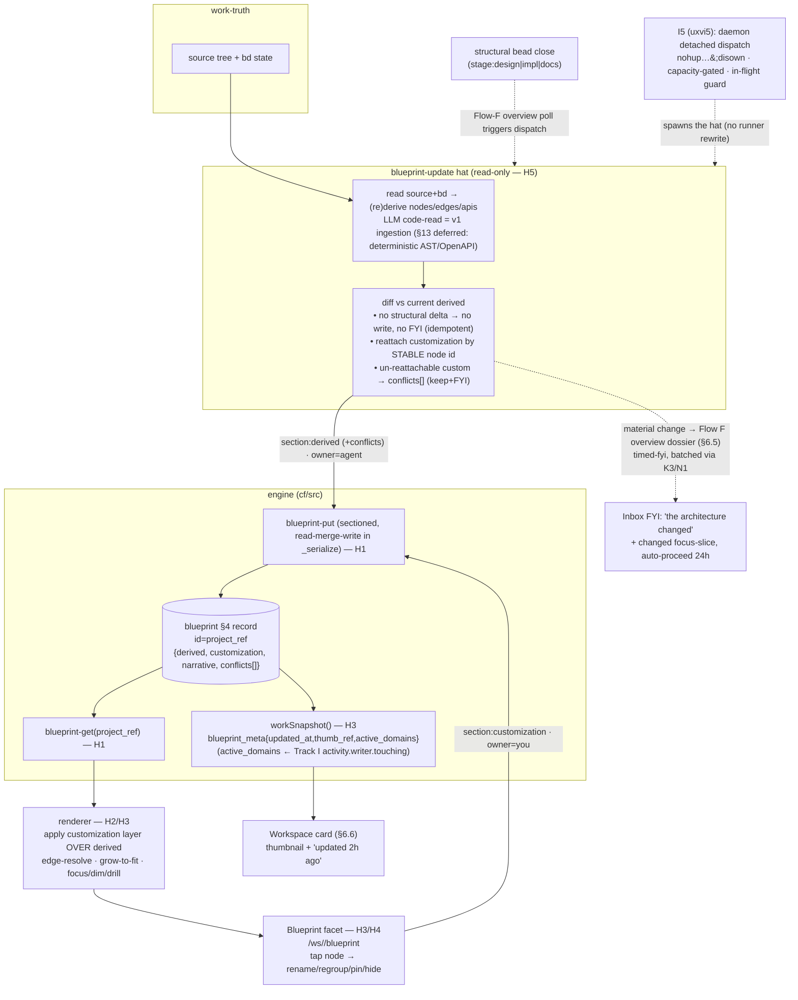

# DESIGN H — The Blueprint (living design + map)

> Track H of the UX v2 overhaul — the biggest, most independent slice. The
> **design** deliverable behind impl beads H1–H5
> (`claude-tools-uxvh1..5`). Owns Flow H:
> [UX-DESIGN-V2 §6](../UX-DESIGN-V2.md) (The Blueprint — living design + map,
> Brian B1/C2) built on the [Architecture Spine](../UX-V2-ARCHITECTURE.md)
> contracts **A.2** (storage class — `blueprint` is a **§4 record**), **A.3**
> (projection-field rule — `blueprint_meta` is read-derived), **B.1**
> (`work-snapshot` projection), **B.2** (the `blueprint-get` record body — the
> backend↔frontend seam), **B.4** (render tolerance), **C** (app-shell +
> `/ws/<ref>/blueprint` facet route), **D.1** (the Blueprint/Dossier noun
> split). The acceptance lens is **principle 9** — *the map is always honest*
> (UX-DESIGN-V2 §11).
>
> **Read the spine first.** This doc conforms to it. Where it refines the spine
> or chooses between two workable shapes it says so and cites the code the
> choice is grounded in. It never re-overloads "Blueprint" against "Dossier"
> (D.1), never lets the updater clobber a human customization (must-protect #3,
> principle 9), and never re-specs the parallel-aux **dispatch** mechanism it
> rides — that is Track I's `I5` (`activity.md §5`, `claude-tools-uxvi5`); H
> owns only the **blueprint-update hat** the dispatch spawns and the
> data-model/customization/trigger seams around it.
>
> **A note on the Diagrammer schema source.** The map node/edge/api **IP** is
> the Diagrammer's (`~/Downloads/HANDOFF.md` §3/5/6/7). The spine froze its
> top-level shape at **B.2** (`derived:{nodes,edges,apis}`) and UX-DESIGN-V2
> **§6.1** enumerates verbatim "the IP which transfers directly and which the
> UI/architect agents must preserve." This doc designs the schema from those
> two **in-repo** sources of truth; the **leaf field names** are A.4
> `[free-ish]` and **H2 reconciles them against HANDOFF §3 verbatim at impl**
> (H2's agent has the file; this design fixes the semantics, not the spelling).

---

## 0. The one-paragraph shape

A Blueprint is **one §4 record per workspace** (`type:"blueprint"`,
`id:project_ref`) holding **two layers that must never overwrite each other**:
`derived` (the machine-truth map — nodes/edges/apis the system computes from
source + bd state) and `customization` (the sticky human layer — Brian's
renames/regroups/pins/hides/splits/merges), plus a `narrative` (the skimmable
design prose) and a `conflicts[]` FYI channel. Track H does four things. (1) It
stores that record and serves it through `blueprint-put`/`blueprint-get`, where
**`blueprint-put` is sectioned** — a `derived`-only write (from the updater) and
a `customization`-only write (from the GUI) are **read-merged** inside the DO's
single-threaded `_serialize`, so the two writers physically cannot clobber each
other's layer (H1). (2) It defines the **derived map schema** porting the
Diagrammer IP — product-domains-not-infra, queues-as-edges, edge-resolution-to-
deepest-visible-ancestor, APIs-as-boundary-boxes (H2). (3) It makes the
customization layer **survive regeneration**: customization is keyed by a
**stable node identity**, applied as a layer *over* `derived` at render time, and
the updater **only ever rewrites `derived` and appends `conflicts[]`** — a
custom name that no longer maps to code becomes a **keep+FYI** conflict, never a
silent revert (H4, principle 9, §14.2). (4) The **blueprint-update read-only
hat** (H5) regenerates `derived` when a structural bead close fires — riding
**I5's** daemon dispatch, not a new mechanism — and the "Blueprint changed"
notification **is the Flow F overview dossier** (§6.5 unify), a batched
`timed-fyi`. The facet (`/ws/<ref>/blueprint`, H3) renders narrative → map,
lights up in-flight domains from Track I's activity, and deep-links `?focus=<id>`.



---

## 1. Vocabulary — Blueprint vs Dossier, derived vs customized  [conforms D.1]

The spine's D.1 noun split is binding for every H surface:

| Word | Means | Backed by | Lifetime |
|---|---|---|---|
| **Blueprint** | the *persistent, always-current* design+map of a workspace | the `blueprint` **§4 record** | durable, one per workspace |
| **Dossier** | an *ephemeral* Inbox decision card | the `dossier` §4 record (unchanged) | expires on decision |

A Blueprint is **not** a Dossier (Brian C2, must-not re-overload). The one place
they touch is §6.4/§8.4: a decision **dossier may borrow a `?focus=<id>` slice**
of the Blueprint to situate itself — it links the map, it does not duplicate it.

Inside the Blueprint record, three layers stay distinct and **the distinction is
load-bearing** (it is what makes principle 9 implementable):

| Layer | Whose truth | Who writes it | Updater may touch? |
|---|---|---|---|
| **`derived`** | the machine (nodes/edges/apis from source+bd) | the blueprint-update hat | **yes — rewrites it** |
| **`customization`** | the human (renames/regroups/pins/hides/splits/merges) | Brian via the GUI | **never** (except append `conflicts[]`) |
| **`narrative`** | the human-facing prose explaining the map | the hat (regenerated with `derived`) | yes — rewrites it |

`conflicts[]` is the **honesty channel** between the first two: when `derived`
moves out from under a `customization`, a conflict is *appended* (keep+FYI),
never resolved by mutating the customization.

---

## 2. The `blueprint` §4 record + its ops  [H1 · claude-tools-uxvh1 · A.2/B.2/A.1]

### 2.1 Storage class: a §4 record, id = `project_ref`  [A.2]

The spine already classified it (A.2 table): the Blueprint is a **§4 record**,
not a transient sibling — it is *owned, addressable by `(type,id)`, versioned,
and appears in the projection + FYI bodies*. So it goes through the full §4
machinery: `_writeRecord` (`coordinator.js:404`) → `validateRecord`
(`schema.js:76`) → principal-stamp (`coordinator.js:418`). Registering the new
type is two mechanical edits the spine's A.1 checklist enumerates:

1. **Register the type + version.** Add `blueprint: 1` to the `SCHEMA_VERSIONS`
   map (`schema.js:24`). `validateRecord` then accepts `type:"blueprint"`,
   rejects an unsafe id, and enforces the integer-≤-bound schema gate (the 4xe
   pattern — UI gates on `schema_version ≤ known`).
2. **Ship the migration.** `cf/migrations/0007_blueprint.sql` (next number after
   `0006_machine_state.sql`). The DO lazily DDLs the `records` table, but the
   migration is the deploy-path source of truth (A.1 step 5). A `blueprint` row
   is just a `records` row `(type='blueprint', id=<project_ref>, body=<json>)` —
   **no new table** (unlike the transient tracks J/I/K); it reuses the shared
   `records` table the registry already owns.

The record **body is B.2 verbatim**:

```jsonc
// blueprint-get(project_ref) → the blueprint §4 record body  [B.2]
{
  "schema_version": 1,
  "project_ref": "rhythmGame",
  "derived":       { "nodes": [...], "edges": [...], "apis": [...] },   // §3 — machine truth
  "customization": { "renames": {...}, "regroups": {...},
                     "pins": [...], "hidden": [...],
                     "splits": [...], "merges": [...] },                // §5 — sticky human layer
  "narrative":     { "tldr": "…", "sections": [{ "heading": "…", "prose": "…" }] }, // §8.3
  "updated_at":    "…",
  "updated_by":    "agent:blueprint-update | you",
  "conflicts":     [ { "kind": "rename-orphan", "node_id": "…",
                       "custom": "Billing", "note": "no longer maps to code" } ] // §5.3
}
```

### 2.2 Ops `blueprint-put` / `blueprint-get`, guarded before the substrate switch  [A.1 / A.4]

A new module `cf/src/blueprint.js`, mirroring the smallest clean §4-record
template `cf/src/lease.js` (its `LEASE_OPS` Set export at `lease.js:101` +
`handleLeaseOp(co, op, args, principal)` at `lease.js:389`, each composing on
`co._writeRecord`). Two ops, registered as a guarded set **before** the main
`switch` exactly like every sibling module (the `LEASE_OPS` guard at
`coordinator.js:354-356`):

```js
// coordinator.js — before the substrate switch (keep the switch byte-stable)
const BLUEPRINT_OPS = new Set(["blueprint-put", "blueprint-get"]);
if (BLUEPRINT_OPS.has(op)) return await handleBlueprintOp(this, op, args, principal);
```

- **`blueprint-get(project_ref)`** — read the `(blueprint, project_ref)` record
  body; missing ⇒ `null` (never a throw — the facet renders an honest "no
  Blueprint yet, request one" empty state, B.4). Pure read, no `_serialize`.
- **`blueprint-put(project_ref, section, body, {updated_by})`** — the
  **sectioned** write (§2.3). `section ∈ {derived, customization, narrative}`;
  plus a `conflicts-append` mode the updater uses. Validates `project_ref`
  (safe-id), rejects an unknown `section` (422, empty body — the
  `machine-state.js:245` reject posture). Goes through `_writeRecord` so the
  body passes `validateRecord` and gets principal-stamped.

**Pages proxies** (A.1 step 3), under `web/functions/api/blueprint/`:
- read `index.js` — `onRequestGet`, hard-codes `blueprint-get`, attaches Bearer
  server-side (template: `web/functions/api/board/index.js:48`).
- write `put.js` — `onRequestPost`, hard-codes `blueprint-put`, **strips any
  client-sent `principal`**, attaches Bearer, passes the engine response
  verbatim (template: `web/functions/api/board/set-desired.js:73`).

**Local adapter** (A.1 step 4 — the 2dk fix): add `blueprint-get` to `argsForGet`
(`cf/pages-dev/adapter.js:68`) and `blueprint-put` to `argsForPost` (`:80`) so
the pages-dev harness can exercise the facet.

**Live-verify before close** (A.1 step 6 — the bgw rule, non-negotiable): a real
authed `blueprint-put`→`blueprint-get` round-trip against
`coordinator-cf.bbthechange.workers.dev` returning the new body shape. `bd close`
on a passing local test only is the bgw failure — forbidden.

### 2.3 Sectioned read-merge-write — never-clobber mechanism #1  [the load-bearing seam]

B.2 says it flatly: *"the updater rewrites `derived` and **never** touches
`customization`."* But a §4 write is whole-record `INSERT OR REPLACE`
(`_writeRecord`). If both writers POST a whole record, last-write-wins and the
updater's `derived` write **silently erases** whatever customization Brian saved
a second earlier (or vice-versa). That is exactly the clobber must-protect #3
forbids. So `blueprint-put` is **sectioned and read-merge-write**, inside the
DO's single-threaded `_serialize` (the same pattern `gate-meta-set` uses to
preserve `set_at` — read the current row, change only the target, write back):

```
handleBlueprintOp("blueprint-put", {project_ref, section, body, updated_by}):
  await co._serialize(async () => {                 // single-threaded — no interleave
    const cur = read (blueprint, project_ref) ?? freshEmptyBlueprint(project_ref)
    cur[section] = body                             // derived | customization | narrative
    cur.updated_at = <stamp>; cur.updated_by = updated_by
    co._writeRecord("blueprint", project_ref, cur)  // whole merged record, validated
  })
```

Because the DO serializes, a `derived` write and a `customization` write that
race **both land** — each merges over the other's last value; neither overwrites
the other's section. This is the engine-level guarantee behind principle 9;
the field separation (§1) is the schema-level guarantee; stable node identity
(§4) is the semantic guarantee. All three are required — any one alone leaks.

`conflicts-append` is its own mode (not a section replace): it pushes onto
`cur.conflicts` rather than replacing it, so the updater can record a new orphan
without dropping prior un-acknowledged FYIs.

### 2.4 "Read-only hat" means read-only **tree**, not read-only engine  [clears a foreseeable confusion]

The blueprint-update hat (§7) is a **read-only auxiliary** — but it **writes the
Blueprint** via `blueprint-put`. There is no contradiction: "read-only hat"
(must-protect #11, `enricher.system.md:3`) means it cannot mutate the **git
working tree** (the conflict-avoidance reason aux agents are parallel-safe). It
can call the **engine** freely, exactly as the enricher writes beads/dossiers
while never touching source. The aux↔writer distinction the spine draws is
*write-capability over the tree* (§5.1), not "makes no API calls." H1's
`blueprint-put` is therefore a legitimate aux action; the permission set
(`specialist.sh:152-205`) blocks `Edit`/`Write`/`MultiEdit` on the tree, not the
engine POST.

---

## 3. The derived map schema  [H2 · claude-tools-uxvh2 · B.2 + UX-DESIGN-V2 §6.1; port HANDOFF §3 verbatim]

`derived` ports the Diagrammer IP. The **semantics below are fixed** (they are
§6.1 "the IP which transfers directly… must preserve" + B.2); the **leaf field
spellings are A.4 `[free-ish]` and H2 reconciles them against HANDOFF §3
verbatim** so the Diagrammer's renderer IP transfers with minimal porting.

### 3.1 `nodes` — product-domain decomposition, nested  [§6.1 mental-model rule]

```jsonc
// derived.nodes[]
{
  "id":        "domain:posts-feed",     // STABLE key (§4) — the customization anchor
  "label":     "Posts & Feed",          // default display name; overridable via customization.renames
  "kind":      "domain",                // domain | client | store | vendor | capability | external
  "parent":    null,                    // nesting: top-level domains have null parent (grow-to-fit drill-in)
  "source_refs": ["src/feed/**", "handlers/posts.js"], // what this node derives from — basis for conflict detection (§5.3) + the honest "no longer maps to code" note
  "auto_opened": false                  // Diagrammer autoOpened-vs-manual; render-state hint, customization wins (§5)
}
```

The taxonomy is §6.1's exact decomposition: **top level is product domains**
(Posts & Feed, Messaging…), **not** infrastructure; plus **the client**, **the
stores**, and **each external vendor as its own box**. Internal capabilities are
**children** (`parent` set) you see on drill-in. **Capabilities, not
Lambda/handler names** — the naming-quality rule (§6, must-protect #4) is encoded
by `kind:"capability"` carrying a human-meaningful `label`, not the function
name. **Queues are NOT nodes** — they are edges (§3.2).

### 3.2 `edges` — the legibility IP (this is what stops arrow-spaghetti)  [§6.1 edge-resolution rule]

```jsonc
// derived.edges[]
{
  "from":      "domain:posts-feed",     // deepest TRUE endpoint node id
  "to":        "store:postgres",        // deepest TRUE endpoint node id
  "kind":      "call",                  // call | queue | data | depends  (queues are edges, not nodes)
  "bundle_key": "posts-feed→postgres"   // duplicates collapse to one rendered edge
}
```

Edges store their **deepest true endpoints**; the **renderer resolves each edge
to its deepest *visible* ancestor** at draw time (the IP, §6.1): at macro zoom an
edge between two capabilities buried in different domains renders as a single
**domain↔domain** edge; on focus, only edges touching the focused subtree show;
duplicates bundle by `bundle_key`. This resolution-and-bundling is the legibility
algorithm that "stops arrows from everywhere to everywhere" — it is **derived-
data-plus-render-logic**, so the schema stores true endpoints and the resolution
lives in the renderer (H2), which is correct: the data is honest, the geometry is
`[free]` (§3.5).

### 3.3 `apis` — boundary boxes ("the way in")  [§6.1 APIs-as-boundary rule]

```jsonc
// derived.apis[]
{
  "id":        "api:POST-/posts",
  "domain":    "domain:posts-feed",     // the node whose border this box straddles
  "route":     "POST /posts",           // the public surface ("the way in")
  "calls":     ["capability:create-post"] // when open, arrows to the internal capability it invokes
}
```

A route renders as a **small box straddling a domain's border** depicting the way
in; opened, it arrows to the internal capability it calls. Modeling APIs as a
**separate top-level array** (not a node `kind`) matches B.2's three-array shape
and keeps the boundary-box render rule from leaking into ordinary node layout.

### 3.4 The renderer IP that must survive the port  [§6.1; H2 acceptance]

H2 ports — and the design forbids dropping — these four Diagrammer behaviors
(they are *the experience*, not chrome):

1. **Mental-model decomposition** — domains over infra; client/stores/vendors as
   boxes; queues as edges (§3.1/3.2).
2. **Grow-to-fit nested layout** — drill into any box to see its children;
   opening a node grows it and reflows siblings ("room to drill in").
3. **Edge resolution + density** — deepest-visible-ancestor resolution +
   duplicate bundling + macro=domain-only + focused=touching-subtree-only (§3.2).
4. **Focus / dim / drill** — click to focus (zoom-to-fit + dim everything not
   connected); drill-out auto-collapses what focus opened **but preserves
   manual/locked state** (the same autoOpened-vs-manual distinction §5 relies on).

### 3.5 Layout engine internals are `[free]`; the schema + edge-IP are not  [ARCH §8]

The HANDOFF says explicitly *don't productionize the prototype* — the geometry
(force layout, coordinates, animation) is replaceable; swap to elk/dagre/
React-Flow later. What **must** transfer is the **schema** (§3.1–3.3) and the
**edge-resolution IP** (§3.2). So H2's bead: port the schema + edge resolution;
treat the layout library as a swappable `[free]` choice inside Contract C's
tokens. **Web acceptance discipline (CLAUDE.md / bgw):** H2's facet bytes are
done only when the unified `claude-wrangler` Pages deploy serves them and
`verify-pages-deploy.sh` prints `mismatches=0`.

---

## 4. Stable node identity — the invariant that lets customization survive regen  [H2 + H4 · the crux]

This is the single most load-bearing decision in Track H, and the one a fast
build gets subtly wrong. **The customization layer keys every override by
`node.id`** (rename of `<id>`, regroup of `<id>` into a domain, pin/hide of
`<id>`). The updater **regenerates `derived` from scratch** on every structural
change. If node ids are **positional or freshly minted each regen**, then after
any regen *every* override points at an id that no longer exists — and the entire
customization layer orphans at once. That is a silent mass-clobber wearing a
"conflict" costume; it fails principle 9 just as hard as a direct overwrite.

Therefore: **`node.id` is a stable content-derived key, not a positional or
random id.** It is derived from the node's stable identity (e.g. a slug of its
domain/role + its `source_refs` anchor — `domain:posts-feed`,
`store:postgres`, `vendor:stripe`, `capability:create-post`), so the *same*
real-world concept gets the *same* id across regens even as siblings/positions
change. The consequence the whole flow depends on:

- A regen that renames the **display label** but keeps the concept ⇒ same `id` ⇒
  the customization **reattaches automatically**. No conflict, no churn.
- A regen where a concept genuinely **disappears** from the code ⇒ its `id`
  vanishes ⇒ the override for that id can't reattach ⇒ **exactly one** conflict
  is appended (§5.3), surgically, for the thing that really changed.

This mirrors the Diagrammer's own `autoOpened`-vs-manual distinction (§6.1): the
manual/locked state is keyed to a node identity stable enough to survive
auto-reflow. H2 (which builds the derived-er) and H4 (which builds the
customization layer) **share this id contract**; it is the seam between them, so
it is specified here once. *Reversible-ish:* the id-derivation function can be
refined, but a change to it is a **migration event** for existing customizations
(old ids stop matching) — so it is a get-it-right-early seam, flagged as such.

---

## 5. The customization layer — sticky, never clobbered, conflict→FYI  [H4 · claude-tools-uxvh4 · principle 9, §6.3, §14.2]

### 5.1 The six override kinds (B.2 verbatim)

```jsonc
"customization": {
  "renames":  { "capability:create-post": "Publish" },   // node id → human label
  "regroups": { "capability:notify": "domain:messaging" },// node id → new parent domain id
  "pins":     ["domain:posts-feed"],                      // node ids whose layout/open-state is locked
  "hidden":   ["vendor:datadog"],                         // node ids suppressed as noise
  "splits":   [ /* one domain → two */ ],
  "merges":   [ /* two domains → one */ ]
}
```

These are §6.3's "human overrides are first-class and sticky" — rename, regroup,
pin, hide, split, merge. This sub-object **is** the per-workspace **glossary** v1
left homeless (UX-DESIGN-V2 §6.3 / §13: "v2 gives it a home — it lives *in the
Blueprint*"). The *storage format/location* question §13 defers is answered
here: it is the `customization` field of the `blueprint` §4 record.

### 5.2 Applied as a layer **over** `derived`, at render time

The renderer (H2/H3) reads `blueprint-get` and **composes**: start from
`derived`, then apply `customization` — substitute labels from `renames`, reparent
per `regroups`, lock `pins`, drop `hidden`, apply `splits`/`merges`. `derived` on
disk is **never** mutated by a customization; the human layer is a *view
transform*. This is what makes "the map is always honest" mechanically true:
`derived` stays a faithful machine reading; the human view is layered on top and
is equally durable.

### 5.3 Conflict detection → `conflicts[]`, keep+FYI (never silent revert)  [§14.2 assumed default, adopted]

When the updater writes a fresh `derived`, it **diffs against the customization's
referenced ids** and, for each override whose `node_id` is **absent** from the
new `derived` (and could not reattach via the stable id, §4), it **appends a
`conflicts[]` entry** — it does **not** delete or rewrite the customization:

```jsonc
{ "kind": "rename-orphan",   "node_id": "capability:create-post",
  "custom": "Publish", "note": "renamed node no longer maps to any code — keep / drop?" }
// kinds: rename-orphan | regroup-orphan | pin-orphan | hide-orphan | split-orphan | merge-orphan
```

The facet surfaces conflicts as a **small FYI** ("your custom name 'Billing' no
longer maps to any code — keep / drop?") with a one-tap keep/drop; the default,
**absent any tap, is KEEP** (the customization persists). This adopts the spine's
§14.2 / UX-DESIGN-V2 §14.2 **assumed answer — *keep + FYI*** (vs auto-drop). Per
the gates.md / activity.md precedent for spine-flagged questions with a
recommended answer, this is **adopted, not re-litigated**: §14.2 is a *non-
blocking* one-tap question Brian can later flip; the design ships the assumed
default and is structured so flipping it to "auto-drop" is a one-line change in
the conflict-resolution policy (the override keys off the conflict `kind`, not
hard-coded behavior). It does **not** block this design or H4. This is the direct
realization of principle 9 and must-protect #3.

### 5.4 Editing is cheap and **in-place** (§6.3 requirement #4)

Customization happens **on the map**, not in a config file Brian must find: tap a
node → rename / regroup / pin / hide. Each edit is a
`blueprint-put(section:"customization", owner:"you")` carrying the *whole* merged
customization sub-object (small; bounded by the map size). The sectioned write
(§2.3) guarantees a concurrent `derived` regen does not eat the edit. `[free]`
(Contract C.3): the exact gesture (long-press vs ✎ affordance), the rename
inline-edit vs modal, the split/merge interaction — all UI choices inside the
token system, none couple to another agent once they emit the B.2 customization
shape.

---

## 6. Naming & grouping — Brian's flagged hard part  [§6.3, H2]

Brian flagged the hard part: *"deciding what to call things, how to group
entities in a way that creates a good mental model."* The design splits this into
an **experience contract** (fixed here) and an **algorithm** (`[free]`):

- **Good defaults are the hat's job, and the algorithm is `[free]`.** The
  blueprint-update hat (§7) proposes `label`s and groupings using §6.1's rules:
  **product domains** (not infra), **capabilities not Lambda/handler names**,
  **vendors as boxes**, **queues as edges**. *How* it decides — prompt heuristics
  now, a richer model later — is `[free]` (ARCH §8: the generator algorithm is
  architecture). What is **fixed** is that `derived` must encode those rules
  structurally (the `kind` taxonomy §3.1, capability labels carrying meaning).
- **A correct-but-ugly auto-map still fails the ask (must-protect #4).** The
  safety net for when defaults are imperfect is the **cheap in-place override**
  (§5.4) — every default is one tap from being fixed, and the fix is **sticky**
  and **survives regen** (§4). The design's posture: don't bet the experience on
  perfect auto-naming; bet it on *good defaults + frictionless, durable
  override*. That combination is the ask; either alone is not.

---

## 7. The updater & the structure-change trigger  [H5 · claude-tools-uxvh5 · §6.2/§6.5; rides I5; unifies Flow F]

### 7.1 The `blueprint-update` read-only hat — what it does

A new hat prompt `beads-runner/agents/blueprint-update.system.md` (naming matches
the existing `enricher.system.md` / `reconciler.system.md` set), registered in
the `--kind=` router (`specialist.sh:104-105`) — which is a **closed reject
set**, so H5 extends both the `case` enum **and** the unknown-kind error string
(line ~106), not just adds a file. On dispatch it:

1. **reads** the source tree + bd state (read-only tree; §2.4);
2. **(re)derives** `nodes/edges/apis` per the §3 schema + §6.1 rules — this LLM
   code-read **is the v1 ingestion** (see §7.6);
3. **diffs** the new `derived` against the current one (`blueprint-get`):
   reattaches customization by stable id (§4); if there is **no structural
   delta**, it **writes nothing and fires no FYI** (idempotent — this is the real
   redraw gate, §7.3);
4. **regenerates** `narrative` to match;
5. **writes** `blueprint-put(section:"derived", owner:"agent:blueprint-update")`
   then `narrative`, and **appends** any `conflicts[]` (§5.3);
6. if the change is **material**, emits the FYI (§7.4).

### 7.2 Dispatch rides I5 — no new mechanism, no runner rewrite  [ARCH §9 dec.1; activity.md §5]

H **does not build a dispatcher.** The blueprint-update hat is one of the aux
kinds **I5 (`claude-tools-uxvi5`) already spawns** (`activity.md §5`: "I5 spawns
the Activity-pool aux kinds — **blueprint-update (Track H5)**, enricher,
xws-responder"). I5 generalizes the daemon's existing out-of-loop dispatch — the
**detached `nohup … & ; disown`** pattern (`daemon/m6-dispatch.sh:175-189`),
capacity-gated against the machine-wide budget, with a per-kind in-flight guard
so two updaters never run at once. H5 therefore **owns the hat** (§7.1) and the
**trigger + FYI semantics** (§7.3–7.4); **I5 owns the spawn**. The split is clean
because the hat is a normal `specialist.sh --kind=blueprint-update` invocation —
the same shape as the enricher (`daemon/intake-dispatch-poll.sh:342-346`) and the
Flow-F overview (`daemon/flow-f-overview-poll.sh:388-392`). *Sequencing:* H5's
hat + trigger can be authored independently; the *parallel* dispatch lands with
I5. Until I5, the hat is still runnable synchronously (like today's enricher) —
I5 only makes it *parallel-with-the-writer*, which is an optimization, not a
correctness gate for H.

### 7.3 The structure-change trigger — generous coarse gate, idempotent real gate  [§6.2]

§6.2 defines "changes the structure" as: *a task closing in `design`/`impl`/
`docs`, or any task whose diff adds/removes a domain, endpoint, store, external
dependency, or cross-domain edge. Trivial closes don't trigger a redraw.* Rather
than build a brittle **pre-close diff classifier** (does this diff add a
domain?), the design uses a **two-stage gate**:

- **Coarse trigger (cheap, already-known-at-close):** the `stage:<value>` label.
  A close carrying `stage:design | stage:impl | stage:docs` **fires a candidate
  dispatch**. This reuses signal the runner already stamps — no diff parsing.
  This is deliberately *generous*: it may dispatch the hat on a close that turns
  out structurally inert.
- **Real gate (the updater's own diff, §7.1 step 3):** the hat regenerates
  `derived` and **only writes / FYIs if `derived` actually changed**. A typo-fix
  close that trips the coarse trigger produces an identical `derived`, so the hat
  no-ops — no version bump, no redraw, no FYI. The expensive precision lives
  where it is cheap (the hat is already reading the tree); the trigger stays a
  one-label check.

This is the honest cheap design: **trigger generously, let regeneration be the
arbiter of "did the structure change."** It cannot miss a real change a
classifier would (the hat sees the actual new tree) and cannot spam on trivial
ones (idempotent write). The coarse trigger **hangs off the existing Flow-F
overview poll** that already fires on stage completion
(`daemon/flow-f-overview-poll.sh`, which today dispatches the dossier-builder) —
H5 wires a *new* blueprint-update trigger path into that same poll rather than
adding a second stage-completion watcher, which is precisely why the
notification unifies with Flow F (§7.4). ("Reuses the poll" = shares its
stage-completion signal, **not** "already wired" — H5 adds the path.)

### 7.4 The "Blueprint changed" notification **is** the Flow F overview dossier  [§6.5 unify; batched K3/N1]

When the hat makes a **material** change, Brian gets **the Flow F overview
dossier as a `timed-fyi`** — *not a second mechanism* (§6.5). Title = the
one-line "what changed about the architecture"; body = TL;DR + the changed
**`?focus=<id>` slice** + deep-link into the Blueprint; **auto-proceeds in 24h**.
This is the exact unification UX-DESIGN-V2 §6.5 / Flow F (§4 "Flow F now feeds the
Blueprint") specify: the overview Brian asked for *is* the Blueprint-changed
ping. The emit seam H owns is a single `notification` §4 record stamped
`tier:"timed-fyi"`, registered as one entry in Track N's trigger catalog (N1,
§10.2 — "Blueprint materially changed → timed-fyi").

**Batching is load-bearing (must-protect #5), and H reuses — never rebuilds —
it.** A burst of structural closes must roll up, not fire N pings. H rides the
already-shipped **K3 read-side digest** (`notif-digest` / the `no_digest` flag,
commit `5365932`) shared with N1 (§10.3). H emits one `timed-fyi`; the shared
batcher rolls bursts into a digest. H never emits `blocking` and never builds its
own batcher — identical posture to gates.md §6's agent-gate FYI.

### 7.5 First creation + the L4 manual-refresh coupling

Because real ingestion is deferred (§7.6), a workspace **starts with no
blueprint** (`blueprint-get` ⇒ `null` ⇒ the facet's honest empty state, B.4).
Two paths create/refresh it, both dispatching the **same hat**:
- **Automatic:** the first structural close (§7.3) generates v1.
- **Manual:** the **L4** "overview-request" intake preset
  (`claude-tools-uxvl4` — "overview-request → Blueprint refresh / FYI, **no bd
  task**") lets Brian ask "show me how this fits together" and get a
  Blueprint refresh without filing a task. L4 is a **soft dep on H1**
  (it needs `blueprint-put` to land its output) — *reuse, not a blocking merge*
  (ARCH §6). H1 ships the op; L4 wires the preset to it.

### 7.6 Deferred: deterministic source-ingestion  [§13, recorded]

§13 defers the **deterministic** ingestion pipeline (IaC/OpenAPI/AST/handler
scan — the Diagrammer's "rebuild note"). v1's ingestion is the **LLM hat's
code-read** (§7.1 step 2): Opus reads the tree and emits `derived` conforming to
§3. This is honest about the trade: the hat is approximate where a parser would
be exact, but it ships now, needs no per-stack parser, and the schema it emits is
identical — so swapping in deterministic ingestion later is a **producer swap
behind a stable `derived` contract**, touching neither the record, the
customization layer, nor the renderer. Recorded as deferred (UX-DESIGN-V2 §13);
not in H1–H5 scope.

---

## 8. Projection, live overlay, narrative & deep-links  [H3 · claude-tools-uxvh3 · B.1/§6.4/§6.6, Contract C]

### 8.1 `blueprint_meta` in `workSnapshot()` — derived, named sub-object  [A.3/B.1]

The Workspace card needs a thumbnail + freshness without fetching the whole map.
B.1 promises `blueprint_meta`; H3 emits it from `workSnapshot()`
(`reconcile.js:670`) into the `projects.push({…})` assembly
(`reconcile.js:744-756`) as a **named sub-object** — never a flat key — so it
never collides with the `activity` / `holds` / `queue_health` keys the sibling
tracks add to the same loop (ARCH §6 "each track owns a named sub-object"). There
is **no existing `blueprint_meta`** in `reconcile.js` today (confirmed); H3 adds
it:

```jsonc
"blueprint_meta": {
  "updated_at":     "…",                       // from the blueprint record (one blueprint-get per project, or join)
  "thumb_ref":      "…",                        // see §8.5
  "active_domains": ["domain:posts-feed"]       // see §8.2 — the live overlay
}
```

Per A.3, this is **derived at read time, never stored** as projection — it joins
the `blueprint` record's `updated_at` into the snapshot. (The map body itself is
**not** inlined into `work-snapshot` — it is fetched on demand via
`blueprint-get` when the facet opens; the snapshot carries only the thumbnail-
sized meta. This keeps the hub snapshot small.)

### 8.2 `active_domains` — the in-flight overlay, a cross-track read of Track I  [§6.4]

§6.4's in-flight overlay ("light up the domains currently being worked, so Brian
can see where the swarm is") is realized by **reading Track I's activity**: the
writer/aux agents carry `touching:[<domain ids>]` (B.1 `activity.writer.touching`
— the same domain ids §3.1 mints). `blueprint_meta.active_domains` is the union
of `touching` across the project's active agents, computed in the same
`workSnapshot` pass. This is a **soft coupling** (ARCH §6): H *reads* a field
Track I *produces* — reuse, not a blocking merge. Two agents `touching` the same
domain is the visible collision-risk signal §6.4 calls out (and the reason
auxiliaries are read-only). If Track I's `touching` is absent, `active_domains`
degrades to `[]` (B.4) — the overlay is simply dark, never a throw.

### 8.3 Narrative render + the facet route  [Contract C.2]

Route **`/ws/<ref>/blueprint`** (Contract C.2 workspace facet; blocked-by
`C-shell` `claude-tools-uxvsh`, done). A pure `deriveBlueprintView(record, now,
opts)` UMD module + thin `app.js`, following the `board-view.js` template (C.1),
reading the `blueprint-get` body (§2.1). The narrative renders the **skimmable
dossier way** (§6.1): **TL;DR → headings → the map → drill-down detail**, and
**expands acronyms on first use**. The map (§3, H2's renderer) is embedded in the
narrative, not a separate page — "the design prose that explains it, *including*
the diagram."

### 8.4 Deep-links `?focus=<id>` — route shape in-contract, focus-render fidelity deferrable  [§6.4/§13]

The route contract (Contract C.2) requires deep-links to **resolve**:
`/ws/<ref>/blueprint?focus=<node-id>`. Three callers deep-link in (must resolve):
**Board** `done·verified` cards → the area they changed (§6.6); a **decision
dossier** → its focused slice (§6.4, the dossier↔Blueprint bridge); the **Flow F
FYI** → the changed slice (§7.4). H3 **owns the route + param contract** so these
links don't 404. The **render fidelity** of focus (zoom-to-fit + dim, §3.4) is
the Diagrammer's own flagged "known gap" and UX-DESIGN-V2 §13 marks `?focus=<id>`
as *UX-required, implementation deferred* — so H3 must make the route resolve to
the right workspace+map (and may land focus as "open at that node, full map"
first), with the zoom/dim polish a `[free]` refinement. The **contract** (the
param exists, resolves, and is what dossiers/Board/FYI emit) is fixed now so the
other tracks can emit the link.

### 8.5 Thumbnail — render `derived` small, no server-side image pipeline  [§6.6, `[free]`]

`thumb_ref` is a lightweight pointer the Workspace card uses to show a mini-map +
"updated 2h ago" (§6.6). The design's default: the card renders a **small static
view of `derived`** through the same H2 renderer at thumbnail scale — **no
server-side image rendering**, consistent with the client-side layout choice
(§3.5). `thumb_ref` therefore points at "render this blueprint at thumb size"
(e.g. the `project_ref` itself), not a stored PNG. `[free]` (C.3): a future
pre-rendered static thumbnail is a cheap optimization if the live mini-render is
ever too heavy — it doesn't change the projection field.

---

## 9. Contract conformance checklist (the must-protect lens)

| Spine item | How Track H conforms |
|---|---|
| **A.2** storage class | `blueprint` = **§4 record**, `id=project_ref` (owned, addressable, versioned, in projection + FYI body); registered in `schema.js` `SCHEMA_VERSIONS` (`:24`), reuses the shared `records` table (no new table) |
| **A.1** add-an-op checklist | new `cf/src/blueprint.js` (lease.js template) + guard in `coordinator.js` (`:354-356` pattern) + Pages proxies (board templates) + `pages-dev/adapter.js` mapping (`:68`/`:80`) + `0007_blueprint.sql` + **live-verify before close** |
| **A.3** projection-field rule | `blueprint_meta` **derived in `workSnapshot()`**, never stored; named sub-object so no collision with `activity`/`holds`/`queue_health` (§8.1) |
| **B.1** projection shape | emits `projects[].blueprint_meta{updated_at,thumb_ref,active_domains}` verbatim; map body fetched on demand, not inlined (§8.1) |
| **B.2** record body | `blueprint-get` returns `{derived,customization,narrative,conflicts[]}` verbatim; updater rewrites `derived` only, never `customization` (§2.3/§5) |
| **B.4** tolerance | missing blueprint ⇒ honest empty state; missing `touching` ⇒ `active_domains:[]`; malformed field ⇒ placeholder + `degraded[]`; only refusal is the integer `schema_version` gate (4xe) — never re-add a render refusal |
| **C** app-shell | `/ws/<ref>/blueprint` facet, `deriveBlueprintView` UMD + thin `app.js` (board-view template); blocked-by `C-shell` |
| **D.1** noun split | Blueprint (persistent §4 record) kept distinct from Dossier (ephemeral) in all copy; the dossier only *borrows* a focus-slice (§1/§8.4) |
| **principle 9** *map is always honest* | `derived` never mutated by customization; customization sticky + keyed by stable id (§4); conflict ⇒ keep+FYI, never silent revert (§5.3) |
| must-protect #1 (bgw) | H1 engine live-verify (`blueprint-put`→`-get` round-trip); H2/H3/H4 close only on `mismatches=0` Pages deploy |
| must-protect #3 (clobber) | three guarantees: field separation (§1), sectioned read-merge-write (§2.3), stable node identity (§4) |
| must-protect #4 (naming quality) | good defaults encoded structurally (§3.1/§6) **+** cheap, sticky, regen-surviving in-place override (§5.4) |
| must-protect #5 (45 pings) | Blueprint-changed FYI is `timed-fyi`, **batched** via the shared K3/N1 spine — never per-close blocking (§7.4) |
| must-protect #11 (aux read-only) | the updater hat is tree-read-only (`specialist.sh:152-205` + hat prompt); engine `blueprint-put` is a legitimate aux action (§2.4) |

---

## 10. Impl split — beads H1–H5

The impl beads already exist under epic `claude-tools-mhcp`, each `--blocked-by`
this design (`claude-tools-uxvdh`). Anchors below are the binding design
reference for each.

| Bead | Scope | Design anchor | Track-type / gate |
|---|---|---|---|
| **H1** `uxvh1` | `blueprint` §4 record (`schema.js` register + `0007` migration) + `blueprint-put`/`-get` ops in `cf/src/blueprint.js` + **sectioned read-merge-write** + Pages proxies + adapter | §2 (+ §4 id contract) | engine (Contract A.2/B.2) — **live-verify engine** (`put`→`get` round-trip) |
| **H2** `uxvh2` | map renderer: port Diagrammer **schema** (§3, reconcile leaf names vs HANDOFF §3 verbatim) + grow-to-fit layout + **edge-resolution IP** + focus/dim/drill; **stable node identity** (§4) | §3 + §4 | **web** (Contract C) — **Pages-verify `mismatches=0`** |
| **H3** `uxvh3` | narrative render (TL;DR→headings→map→detail, acronym-expand) + `/ws/<ref>/blueprint` facet route + `blueprint_meta` in `workSnapshot` + `?focus=<id>` route contract + deep-links | §8 | **web** + engine (Contract B.1/C) — **Pages-verify** + projection live-verify |
| **H4** `uxvh4` | customization: rename/regroup/pin/hide/split/merge **in-place**; sticky (layer over `derived`); **conflict-FYI keep+default** (§14.2 assumed) | §5 (+ §4 shared id contract) | **web** + engine (Contract B.2/B.4) — **Pages-verify `mismatches=0`** |
| **H5** `uxvh5` | `blueprint-update` read-only hat (`agents/blueprint-update.system.md` + `specialist.sh` kind) + structure-change trigger (stage-coarse + idempotent-regen) + change→`timed-fyi` **= the Flow F overview** (batched via K3/N1) | §7 | runner/daemon + agent — **rides I5 dispatch**; hat runnable synchronously pre-I5 |

**Dependency notes** (mirror the bead graph):

- **H2 ⟶ H1** — the renderer reads the `blueprint-get` body; the record+ops exist
  first. **H3/H4 ⟶ H1 + `C-shell`** (`uxvsh`, done) — all facet UIs are
  `--blocked-by C-shell`.
- **H2 ↔ H4 share the §4 stable-node-id contract** — author it once (§4); both
  beads cite it. A drift here re-orphans every customization (the §4 hazard).
- **H5 rides I5** (`uxvi5`, the parallel-aux dispatch) — *reuse, not a blocking
  merge* (ARCH §6). H5's hat + trigger are authorable independently; I5 makes the
  dispatch parallel-with-the-writer. The FYI rides Track **N1/K3** batching
  (reuse). H5 also reuses the **Flow-F overview poll** (`flow-f-overview-poll.sh`)
  as its coarse trigger — the unification §6.5 specifies.
- **Soft couplings (named, non-blocking):** **L4** (`uxvl4`, overview-request →
  Blueprint refresh) needs H1's `blueprint-put`; **K5** (Cross-WS coupling map)
  reuses H2's renderer for a federated Blueprint slice (`activity.md`/ARCH §6).
  Both are *reuse*, sequenced after the piece they borrow, never merged into it.
- **Cross-track read:** H3's `blueprint_meta.active_domains` reads Track **I**'s
  `activity.writer.touching` (§8.2) — sequence after I2 lands `activity` in the
  projection, but it degrades to `[]` if absent (B.4), so it is not a hard block.

---

## 11. What's deliberately `[free]`

Per ARCH §8 — move fast; none of these couple to another agent once the
`blueprint` record shape, the B.2 body, the §3 schema, and the §4 stable-id
contract hold:

- **The layout engine internals** (§3.5) — force layout, coordinates, animation,
  elk/dagre/React-Flow choice. Port the schema + edge-IP; the geometry is
  replaceable (the HANDOFF says so explicitly).
- **The naming/grouping *algorithm*** (§6) — prompt heuristics now, a richer
  model later. The *experience* (good-defaults + sticky override) is fixed; the
  generator is architecture.
- **Customization gesture ergonomics** (§5.4) — long-press vs ✎, inline vs modal
  rename, the split/merge interaction — all inside Contract C tokens.
- **`?focus=<id>` render fidelity** (§8.4) — zoom-to-fit + dim polish is a
  refinement over "open at that node"; the route *contract* is fixed now.
- **Thumbnail strategy** (§8.5) — live mini-render vs a future pre-rendered
  static; the `thumb_ref` projection field doesn't change either way.
- **The FYI cadence / "material change" precision** (§7.3/§7.4) — tuned from data
  via the shared batcher; a §14-class tunable, not a contract.
- **Op/table/field names within the flow** before it ships (A.4) — `blueprint-put`
  section names, the `node.id` slug scheme, `conflict.kind` values — rename
  freely pre-ship; **reconcile §3 leaf names against HANDOFF §3 verbatim at H2**
  so the Diagrammer renderer IP ports with minimal churn.

---

*Amend like the frozen design docs: explicit section, rationale, date. The
**stable node identity** contract (§4) and the **sectioned write** (§2.3) are the
get-it-right-once seams — changing either is a migration event for existing
Blueprints.*
