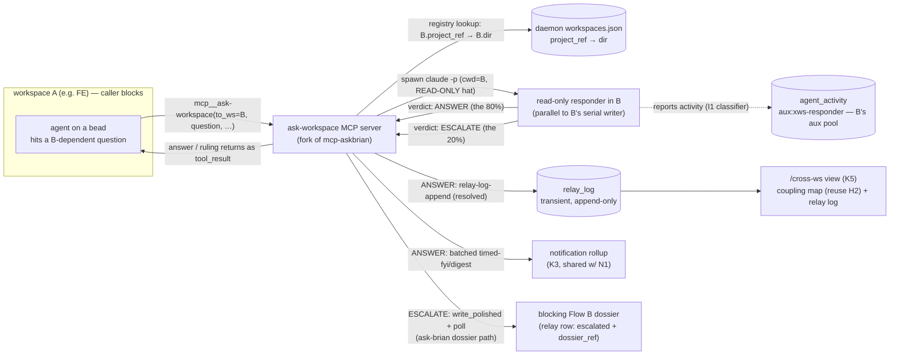

# DESIGN K — Cross-workspace sync (FE↔BE)

> Track K of the UX v2 overhaul. The **design** deliverable behind impl beads
> K1–K5 (`claude-tools-uxvk1..5`). Owns Flow K:
> [UX-DESIGN-V2 §8](../UX-DESIGN-V2.md) (cross-workspace sync, B2/C4) built on the
> [Architecture Spine](../UX-V2-ARCHITECTURE.md) contracts **A.2** (storage
> class), **B.3** (`relay-log-tail` projection), **B.4** (render tolerance),
> **C** (app-shell + `/cross-ws` route), **D.2** (notification tiers). It is the
> productization of `claude-tools-r0m` (the v1 "cross-workspace agent-to-agent"
> research task, deferred to 2030; B2 makes it in-scope now).
>
> **Read the spine first.** This doc conforms to it. Where it refines the spine
> or chooses between two workable shapes it says so and cites the code the
> choice is grounded in. It never re-specs the ask-brian MCP plumbing it forks,
> the Diagrammer renderer it reuses (H2), or the notification batching spine it
> shares (N1) — it points at each and adds only the cross-WS-specific seam.

---

## 0. The one-paragraph shape

It is **the ask-brian pattern pointed sideways.** An agent in workspace **A**
hits a question that depends on workspace **B** and calls the
`mcp__ask-workspace__ask-workspace` tool — a sibling of `ask-brian`, forked from
the repo-root `mcp-askbrian/server.mjs` + `mcp-askbrian/helpers/engine-bridge.sh`
(all `mcp-askbrian/…` paths in this doc are **repo-root-relative**, not under
`beads-runner/`). The MCP server resolves
**B**'s local path from the daemon's workspace registry, spawns a **read-only**
`claude -p` responder with `cwd = B` (the exact fork of ask-brian's `runBuilder`,
swapped to the read-only hat permission set so it **cannot** mutate B's tree),
and **blocks**. The responder answers from B's code + docs + bd + Blueprint and
emits one of two verdicts: **answer** (the mechanical 80%) or **escalate** (a
contract conflict or a missing design — the 20%). On **answer**, the server
appends the exchange to an append-only **`relay_log`** transient, FYIs Brian via
the **batched** `timed-fyi`/`digest` tier (load-bearing — without it C4 becomes
45 pings), and returns the answer to A as the `tool_result`; A resumes in-session.
On **escalate**, the server routes the conflict into a **blocking Flow B dossier**
— reusing the ask-brian dossier-publish-and-block path verbatim — so Brian rules,
and the relay row records `outcome:"escalated"` with the dossier link. A global
`/cross-ws` surface renders the **coupling map** (a federated Blueprint slice,
reusing the H2 renderer) and the **relay log** (`relay-log-tail`).



---

## 1. The `ask-workspace` MCP server — the fork  [K1 · claude-tools-uxvk1]

K1 forks `mcp-askbrian/server.mjs` + `helpers/engine-bridge.sh` into a sibling
`mcp-ask-workspace/`. The fork is deliberate: ask-brian already solved every hard
part of this shape — a `claude -p` child spawned with a scoped tool surface, a
blocking poll, a durable engine write, and the `tool_result.is_error = null`
contract the runner's `scan_stream_for_tool_errors` depends on (R1 Q1). We change
**what gets spawned and where**, **what the answer's two outcomes are**, and
**what gets logged** — not the MCP/`claude -p`/blocking machinery.

### 1.1 The tool and its inputs

One tool, `ask-workspace`. Inputs mirror ask-brian's lenient shape (a worker
under pressure can't hand-author a schema) plus the cross-WS routing key:

```jsonc
{
  "to_ws":      "BE",                       // REQUIRED — target workspace project_ref (registry key)
  "question":   "Is the cancel endpoint deployed? What's its response shape?",  // REQUIRED
  "context_dump":"FE assumes DELETE /orders/:id → 204…",   // REQUIRED — the asking agent's framing/assumptions
  "bead_ref":   "thirsty-fe-93o"            // REQUIRED — A's bead (relay attribution + dedupe; mirrors ask-brian)
}
```

`from_ws` is **not** a trusted input — it is resolved server-side from the MCP
server's own `cwd`/`PROJECT_REF` (the same `resolveProjectRef()` ask-brian
already ships), exactly as the engine overwrites a wire `principal`. `to_ws` is
the only client-supplied routing key and is gated through `safeKey` before any
filesystem use.

### 1.2 Routing — registry lookup, same-machine (the one grounded assumption)

`to_ws` → B's absolute path comes from the **daemon workspace registry**
(`~/.config/claude-tools/workspaces.json`, loaded by
`daemon/workspace-registry.sh`): each entry carries `project_ref`, `dir`
(absolute workspace root), `coordinator_url`, `coordinator_token_keychain`
(`workspace-registry.sh:16-17,87-100`). The server reads the registry, finds the
row whose `project_ref == to_ws`, and uses its `dir` as the responder's `cwd`.

This makes the **same-machine** assumption explicit: A and B are two workspaces
the same daemon manages on one host (Brian's real FE/BE setup, and r0m's stated
use case). Cross-machine relay is **out of scope** and lands in the same deferred
bucket as v1's "coordinator reachability" (UX-DESIGN-V2 §13) — flagged, not
silently assumed. If `to_ws` resolves to no registry row, the tool returns a
terse, actionable error (the asking agent proceeds on its own judgment or files
a bead), never a fabricated answer.

> **Why the MCP server spawns the responder directly (not the daemon).** r0m's
> original sketch had A *write a request record*, the daemon in B *observe it on
> poll* and dispatch, and A's MCP call *poll the engine* for the answer. The
> ask-brian fork gives us a strictly simpler shape that the validated ask-brian
> code already runs: the MCP server spawns the child itself, synchronously, and
> blocks — exactly as `runBuilder` spawns the dossier-builder. No new
> dispatch-queue record type, no daemon poll latency on the request leg, and the
> "blocks then resumes in the same session" property (§8.1) falls out for free.
> The responder still **appears in B's aux pool** because it self-reports through
> I1's classifier (§2.3) — "parallel auxiliary in B's pool" (§8.1) is satisfied
> by *reporting*, not by *who pressed spawn*. design-I §5 lists `xws-responder`
> among the daemon's detached aux kinds (I5); that remains the placement if a
> future cross-machine or fire-and-forget relay is built, but the **blocking**
> path B2 asks for is MCP-spawned. Reversible: only the spawn site moves; the
> hat, the verdict split, `relay_log`, and the view are placement-independent.

### 1.3 What the fork keeps verbatim

- The `claude -p` child plumbing: `--system-prompt @<hat>`, `--add-dir`,
  `--output-format json`, output-cap + SIGTERM→SIGKILL timeout, JSON-fence
  stripping, thin-output quality gate (`server.mjs:202-400`). Reused as-is for
  the responder spawn.
- The blocking poll loop + `tool_result` shape with `isError` unset so
  `tool_result.is_error` is `null` (R1 Q1; `server.mjs:792-844`). **For the
  escalation path only** — the answer path returns the responder's text directly.
- The graceful-shutdown drain latch (`server.mjs:128-158`) and the engine-bridge
  auth/transport wiring (`engine-bridge.sh:41-62`).

### 1.4 What the fork changes

| ask-brian | ask-workspace |
|---|---|
| spawns dossier-builder at `cwd = process.cwd()` (A) | spawns **responder** at `cwd = registry[to_ws].dir` (B) |
| builder spawned inline (`server.mjs:217-264`): `--allowedTools Read Grep Glob Bash`, `--permission-mode acceptEdits` | **read-only responder hat** via `specialist.sh` (§2.1): `NO_CODE_EDITS` **disallowed**, `--permission-mode default` — strictly more locked down |
| always → publish dossier + block | **two verdicts**: answer → return + log; escalate → publish dossier + block |
| writes a `dossier` §4 record | writes a `relay_log` transient row per exchange (§3); a dossier **only** on escalate |
| FYI tier inherited from dossier (`blocking`) | answer → **batched `timed-fyi`/`digest`** (§4); escalate → `blocking` |

The engine-bridge fork adds two sub-commands — `relay-log-append` and
`relay-log-tail` (§3) — alongside the existing `id_for` / `write_polished` /
`write_fallback` / `poll_once` it inherits for the escalation leg.

---

## 2. The read-only responder  [K1 · claude-tools-uxvk1]

### 2.1 Read-only by construction — reuse the existing hat permission set

The responder is **read-only by construction** (must-protect #11). It does **not**
get a bespoke permission list — it reuses the `reconciler|enricher` posture in
`agents/specialist.sh:196-205`, which is already the canonical read-only hat:

```
ALLOWED    = COMMON_ALLOWED   # Read Grep Glob LS, Bash(bd:*), Bash(git:*), read-utils
DISALLOWED = GUARDRAIL + NO_CODE_EDITS
             # GUARDRAIL      = AskUserQuestion EnterPlanMode ExitPlanMode  (specialist.sh:132)
             # NO_CODE_EDITS  = Write Edit MultiEdit NotebookEdit BashWriteEdits  (specialist.sh:137)
PERMISSION_MODE = default
```

K1 adds a **new `xws-responder` KIND** to the `specialist.sh` `case` that selects
exactly this `reconciler|enricher` arm (same `ALLOWED`/`DISALLOWED`/mode). This
is defense-in-depth behind the prompt: the responder **physically cannot** edit
B's tree, run a build, or commit — the only side effects it can produce are
read-only `bd`/`git`/grep calls. That is precisely B2's "can't modify code"
constraint, enforced by the same set Track I relies on for the aux pool.

### 2.2 The system prompt — fork the reconciler hat, add the 80/20 split

The responder hat (`agents/xws-responder.system.md`) is a short fork of
`reconciler.system.md` (the conservative read-only "figure out the right answer,
don't guess past the evidence" posture). It instructs:

- **You are a domain-expert responder for THIS codebase, answering one question
  from a sibling workspace's agent.** Answer **only** from B's code, docs, bd,
  and Blueprint. Question in, answer out — surface **nothing** of B's broader
  context beyond what the answer needs (r0m privacy/scope item 4).
- **Emit a structured verdict** (one JSON object on stdout, the same
  discipline the dossier-builder follows):

  ```jsonc
  // verdict: answer  (the mechanical 80%)
  { "verdict": "answer",
    "answer": "Deployed since commit a1b2c3. Shape: { ok, refunded_cents }. 204 on already-cancelled.",
    "evidence": ["cf/src/orders.js:88", "thirsty-be-12f closed"] }

  // verdict: escalate  (conflict or missing design — the 20%)
  { "verdict": "escalate", "reason": "conflict|missing_design",
    "summary": "FE assumes 204; BE returns 200 + body. Contract drift.",
    "conflicting_claims": ["FE: DELETE→204 empty", "BE orders.js:88: 200 + {ok,refunded_cents}"],
    "options": [ { "label": "FE adopts BE's 200+body", "blast_radius": "…" },
                 { "label": "BE changes to 204", "blast_radius": "…" } ],
    "recommendation": "FE adopts BE's shape (already deployed)" }
  ```

- **Escalate, do not paper over (§8.3).** If the two workspaces **disagree on a
  contract** (a conflict) or **neither side has decided the shape** (a missing
  design), do **not** invent an answer — emit `verdict:"escalate"`. These are
  exactly the cases the thirsty transcripts show Brian's mediation *caught* (the
  post-feed schema drift; the saly epoch-bump). When in doubt, escalate — a
  blocking dossier is cheap; a confidently-wrong cross-WS answer poisons both
  sides (the reconciler hat's "file a follow-up rather than guess" applied
  sideways).
- **Depth-1, no recursion (r0m item 5).** The responder is **not** given the
  `ask-workspace` MCP tool (it is not registered in its spawn), and the prompt
  forbids initiating further cross-WS asks. A responder cannot trigger another
  responder; cycles are impossible by construction.

The MCP server parses the verdict (reusing the fork's fence-strip +
first-JSON-object extractor, `server.mjs:402-438`): `answer` → §3 + §4 + return;
`escalate` → §5. A malformed/empty verdict is treated as escalate-to-safe (never
a silent fabricated answer) — the conservative default.

### 2.3 Parallel with B's writer, visible in B's aux pool

The responder runs as a separate `claude -p` at `cwd = B`, **concurrent** with
B's serial `run-beads-tasks.sh` writer loop. It is safe to run in parallel
because it is read-only — it takes **no writer lease** (it is not claiming a bead)
and cannot touch the tree, so it cannot conflict with B's in-progress work
(§8.1; design-I §2). It self-reports through I1's shared activity classifier
(design-I §1.4) with `agent_key = aux:xws-responder:<dispatch_id>`,
`lane = auxiliary`, `kind = xws-responder`, so it shows up live in B's
**auxiliary pool** on the Activity facet — the "auxiliary in B's pool" property of
§8.1. (This is the activity-reporting seam, not a daemon dispatch — see §1.2.)

### 2.4 Workspace-scope guardrail carried from thirsty (§8.5)

Orthogonal to the relay itself but owned here: a task that references a
**cross-repo id** and is not a tracking-only task is **flagged, not silently
claimed** by the wrong workspace's runner (the "why is there a backend task in
the frontend tracking" frustration). This is a small pickup-time check on the
worker side; K1 records it as the design home, and it rides the same
`RUNNER_NO_CLAIM_LABELS` suppression Track J/D.2 already define rather than
inventing a new mechanism.

---

## 3. `relay_log` transient + ops  [K2 · claude-tools-uxvk2]

### 3.1 Storage class — transient, append-only (A.2)

Per **A.2** (binding): the cross-WS relay log is a **transient** `relay_log`
table, the `forensic_audit` precedent — *"append-only audit, no `(type,id)`
owner."* It is **not** a §4 record: it bypasses `_writeRecord` / the schema.js
registry, is **structurally absent** from the §4.5 projection and §4.3
notification bodies (it must never page anyone by itself — that is K3's batched
job), and `get relay_log <id>` is `unknown_type` by construction. The closest
existing code is `forensic.js`'s `forensic_audit` table
(`forensic.js:120-124,243-258,415-425`): an `INTEGER PRIMARY KEY AUTOINCREMENT`
append-only log with an `INSERT`-only writer and an `ORDER BY id` tail.

### 3.2 The module — a new `relay.js`, mirroring the smallest transient modules

K2 ships `cf/src/relay.js` following the A.1 module shape exactly (the
`capacity.js`/`machine-state.js` templates; `forensic.js` for the append-only
specifics):

```js
export const RELAY_OPS = new Set(["relay-log-append", "relay-log-tail"]);
export async function handleRelayOp(co, op, args, principal) { … }
```

with a lazy, idempotent `ensureRelaySchema(co)` (CREATE TABLE IF NOT EXISTS,
per-instance memoised, `forensic.js:105-136` pattern). Unlike `forensic_audit`'s
single opaque `line`, `relay_log` uses **typed columns** because `relay-log-tail`
must **filter by `project_ref`** (B.3) — a JSON-blob line would force a JS scan:

```sql
CREATE TABLE IF NOT EXISTS relay_log (
  id INTEGER PRIMARY KEY AUTOINCREMENT,
  exchange_id  TEXT NOT NULL,          -- stable id (hash of from|to|bead|seq)
  project_ref  TEXT,                   -- tail filter key (the from_ws workspace)
  from_ws      TEXT, to_ws TEXT,
  at           TEXT,                   -- RFC-3339 UTC …Z (§0.4)
  question     TEXT, answer TEXT,
  outcome      TEXT,                   -- "resolved" | "escalated"
  dossier_ref  TEXT                    -- escalated → the Flow B dossier; else null
);
```

The canonical migration ships as `cf/migrations/NNNN_relay.sql` (A.1 step 5,
deploy-path source of truth) even though the DO lazily DDLs.

### 3.3 The ops

- **`relay-log-append <exchange_json>`** — `INSERT` one row, never `UPDATE`/
  `DELETE` (append-only, A.2). Called by the MCP server **once per exchange**,
  after the verdict resolves: `outcome:"resolved"` for an answer,
  `outcome:"escalated"` (with the just-created `dossier_ref`) for an escalation.
  Because the dossier is created **before** the responder returns (§5), the final
  outcome is known at append time — one append captures it, so the log never
  needs a mutating second write. Runs inside `co._serialize` (the singleton-DO
  critical-section discipline every store-touching op follows; `forensic.js:454-507`).
- **`relay-log-tail [project_ref] [n]`** — `SELECT … [WHERE project_ref = ?]
  ORDER BY id DESC LIMIT n`, reshaped to the **B.3** projection verbatim:

  ```jsonc
  { "exchanges": [
    { "id": "…", "from_ws": "FE", "to_ws": "BE", "at": "…",
      "question": "…", "answer": "…",
      "outcome": "resolved|escalated", "dossier_ref": "…|null" } ] }
  ```

  A read-only tail ⇒ no `co._serialize` (the pure-op short-circuit `forensic.js`
  and `notification.js` use). Omitting `project_ref` returns the cross-WS log
  across all workspaces (the global `/cross-ws` view, §6); passing it scopes to
  one workspace's outbound asks.

### 3.4 Wiring (A.1 checklist) + live-verify

K2 is **not done** until every A.1 layer lists the ops: (1) `relay.js` module;
(2) the `if (RELAY_OPS.has(op)) return await handleRelayOp(…)` guard in
`coordinator.js` `fetch()` **before** the substrate switch (keep the switch
byte-stable); (3) Pages proxies — read `web/functions/api/cross-ws/relay-log.js`
(`onRequestGet`, hard-codes `relay-log-tail`), write proxy for `relay-log-append`
(strips client `principal`, attaches `Bearer` server-side); (4) the
`cf/pages-dev/adapter.js` REST mapping (the layer 2dk forgot); (5) the migration;
(6) **live-verify before close** — a real authed `relay-log-append` then
`relay-log-tail` against `coordinator-cf.bbthechange.workers.dev` returning the
B.3 shape. `bd close` on a passing local test is the bgw failure — forbidden.

---

## 4. Always-FYI digest-batching — load-bearing  [K3 · claude-tools-uxvk3]

### 4.1 Why this is not optional

Brian chose: **every** exchange FYIs him (C4). The thirsty data shows ~45 FE↔BE
coordination messages over the build. So the load-bearing mechanism that makes
"always FYI" **not** become 45 pings is **digest-batching** (UX-DESIGN-V2 §8.2;
ARCH must-protect #5: *"K3 ships with H/K, not later"*). Without it, C4
reproduces exactly the courier-overload it was meant to remove. K3 is **P1** and
ships **with** K1/K2 — not deferred.

### 4.2 The mechanism — a read-side rollup keyed off the notification `channel`

The notification record already carries everything batching needs; **no schema
change** is required (the design was left forward-compatible). A
`timed-fyi`/`digest` notification carries an opaque `channel` tag that
*"a later read-side digest rollup keys off … with no schema change"*
(`notification.js:400-407,209-210`). K3 realizes that read-side rollup for
cross-WS:

1. Each **answered** exchange emits a notification at tier **`timed-fyi`**
   (auto-proceeds on silence; reversible — the answer already landed in A's
   session) tagged `channel = "xws:<project_ref>"` (or a finer
   `xws:<from>:<to>`). The body is one line: *"FE asked BE: cancel endpoint? →
   BE: deployed since cmt a1b2c3, shape {…}. FE proceeding."*
2. The **read-side rollup** groups pending cross-WS notifications by `channel`
   and renders **one** digest entry: *"BE↔FE: 6 syncs today — all resolved, none
   needed you."* Brian **expands** it to read each exchange; the expansion source
   is `relay-log-tail` (§3) — the digest is the summary, the relay log is the
   detail behind it. This is principle 1 ("never ping twice for what could be one
   digest") applied to relays.
3. **Tier escalation is per-exchange, not batched.** An exchange that escalates
   (§5) emits a **`blocking`** notification (trigger catalog: *"Cross-workspace
   conflict / missing design → blocking"*) — it is **never** swept into the
   digest. The split is the whole point: mechanical sync → batched FYI; real
   conflict → an immediate decision.

> **Realized by [claude-tools-mhcp.1].** K3 built the read-side rollup (item 2)
> but the answer path emitted a `relay_log` row only and pinged nothing, so the
> rollup had zero cross-WS rows to batch and the C4 always-FYI promise was unmet
> for the 80%. mhcp.1 wires item 1: after `relay-log-append`, the answer path
> calls the engine-bridge `emit_fyi <from_ws> <ref>` → `no_emit_fyi`
> (`lib/notification.sh`), a **dossier-less** §4.3 producer. It is dossier-less
> by necessity: `no_emit` mirrors a dossier's §4.1 tier and the answer path
> creates **no** dossier (only escalate does, §3.3), so the FYI stamps an
> explicit `timed-fyi` tier + the `xws:<from_ws>` channel directly, with
> `dossier_ref` = the relay **exchange id** it announces. Because a §4.3
> notification carries **no content** (principle 2), the *"FE asked BE: …? → BE:
> …. FE proceeding."* one-liner above is **not** stored on the notification — it
> lives in the `relay_log` row (question + answer) and the digest **expands via
> `relay-log-tail`** (item 2). The notification is the channel-tagged **counter**
> the rollup groups. It composes the generic `put notification` front door, so
> no new CF op / schema change is needed (the record store is already CF.9). The
> id is deterministic (`notif.<exchange_id>`) ⇒ a re-emit is idempotent (no
> double-count). The 20% escalate path keeps notifying `blocking` via the
> inherited dossier emit — it never fires `emit_fyi`.

### 4.3 Shared with N1 (the notification spine)

This is the **same batching spine** N1 builds for the whole trigger catalog
(§10.3: "N pending → 1 digest"). K3 and N1 share it: K3 owns the cross-WS
`channel` convention and the rollup copy; N1 owns the general
group-by-channel-and-roll-up engine. Build the rollup **once** in the shared
notification read path (consumed by both); K3 is the first and highest-volume
consumer. The digest **cadence** (daily assumed) is [free] (ARCH §8 / §14 open
question) — tune from data without re-touching the mechanism.

---

## 5. The 20% that escalates → blocking Flow B  [K4 · claude-tools-uxvk4]

### 5.1 An escalation *is* an ask-brian call

When the responder returns `verdict:"escalate"` (§2.2), the conflict becomes a
**blocking Flow B dossier** — and here the fork pays off twice, because the
**entire dossier-publish-and-block path already exists in the code we forked.**
The MCP server maps the responder's `{summary, conflicting_claims, options,
recommendation}` onto a `worker_ask` (the same `buildWorkerAsk` normalization
ask-brian uses, `server.mjs:485-494`) and calls the inherited engine-bridge legs:

- `id_for <bead_ref>` → deterministic dossier id (dedupe, §7.4).
- `write_polished` (or `write_fallback` on builder absence) → persist a
  `blocking` §4 `dossier` durable cloud-side, then `emit_and_dispatch` the
  notification (`engine-bridge.sh:89-108`).
- the **poll loop** (`server.mjs:792-844`) → block A until Brian taps an answer,
  then return his ruling as the `tool_result`.

A is now blocked on Brian's decision exactly as if it had called `ask-brian`
directly — which is correct: the cross-WS question turned out to be a
human-decision fork. No new dossier machinery; the escalation **reuses** it.

### 5.2 The relay row records the escalation

Before the server enters the dossier poll, it appends the relay row with
`outcome:"escalated"` and `dossier_ref = <the dossier id>` (§3.3). This makes the
relay log honest about the 20%: Brian can see in `/cross-ws` (§6) that an
exchange became a decision, click straight through to the dossier, and trust that
the 80% he is no longer couriering actually resolved. The dossier and the relay
row stay consistent because the relay append happens at the same point the
dossier is created — one exchange, one row, final outcome known.

### 5.3 What counts as conflict vs. missing-design

The responder (§2.2), not the server, makes this call — it is the side with B's
code in context. **Conflict** = the two workspaces hold contradictory claims
about a shared contract (FE expects 204, BE returns 200+body). **Missing design**
= neither side has decided the shape (the endpoint doesn't exist and no bd task
owns it). Both → escalate. Everything mechanical and decided → answer. The
detector is the prompt + the model's read of the evidence; it is deliberately
**conservative** (malformed verdict ⇒ escalate, §2.2) because an over-escalation
costs Brian one tap, while a missed conflict costs a silent contract drift.

---

## 6. The Cross-WS global view  [K5 · claude-tools-uxvk5]

A global surface at **`/cross-ws`** (Contract C.2: a global nav route, not a
workspace facet) shows two panes (UX-DESIGN-V2 §8.4):

### 6.1 Coupling map — a federated Blueprint slice (reuse H2's renderer)

The coupling map is **not a new renderer.** The Diagrammer already models APIs as
boundary boxes and externals as boxes (B.2; HANDOFF §3) — *"a sibling workspace
is just another boundary."* K5 builds a **federated `derived` slice**: A's
domains ↔ B's domains via the APIs that cross between them, assembled from each
workspace's `blueprint-get` (`derived.apis` / boundary nodes), and hands it to
the **H2 map renderer verbatim** (the Diagrammer schema + grow-to-fit layout +
edge-IP H2 ships). K5 is `--blocked-by` H2 (`claude-tools-uxvh2`) precisely
because it is renderer **reuse**, not re-spec — the only K5-specific code is the
federation step that joins two single-workspace blueprints into one cross-WS
graph. This lets Brian *see* FE↔BE coupling, the B6-adjacent ask.

### 6.2 Relay log — the auditable record (`relay-log-tail`)

The second pane is the running list of exchanges and outcomes from
**`relay-log-tail`** (§3, no `project_ref` → all workspaces): each row shows
from/to, question, answer (or **escalated → dossier link**), and time. This is
the auditable trail behind the batched FYIs — the thirsty "trust it landed
without checking" principle applied to relays. It reuses the inbox-style list +
the B.4 tolerance discipline (every field degrades to an honest placeholder +
`degraded[]`, never a throw; the only refusal is the integer schema-gate — never
re-add a render refusal).

### 6.3 Web-track acceptance

K5 is a **web** bead and is **not done until the deployed Pages site serves the
new bytes** (CLAUDE.md web-track discipline / claude-tools-bgw): it ships inside
the unified `claude-wrangler` Pages project, and closes only on
`wrangler pages deploy … --project-name claude-wrangler` +
`verify-pages-deploy.sh` → `mismatches=0` against the live host. Local-green +
committed is not acceptance. K5 is `--blocked-by` `C-shell` (`claude-tools-uxvsh`,
done) for the nav/route/shared plumbing, and K2 for `relay-log-tail`.

---

## 7. Contract conformance checklist (the must-protect lens)

| Spine item | How Track K conforms |
|---|---|
| **A.1** op checklist | `relay-log-append/-tail` ship module + guard + read/write Pages proxy + pages-dev adapter + migration + **live-verify** before close (§3.4) |
| **A.2** storage class | `relay_log` = **transient** append-only, `forensic_audit` precedent; not a §4 record; absent from projection + notification bodies (§3.1) |
| **A.3** projection rule | the view reads only `relay-log-tail` (B.3) + `blueprint-get` (B.2) — no field read off a table directly |
| **A.4** naming | `relay-log-append`/`relay-log-tail` (kebab `<concern>-<verb>`); `relay_log` table snake_case |
| **B.3** projection shape | `relay-log-tail` returns `{exchanges:[{id,from_ws,to_ws,at,question,answer,outcome,dossier_ref}]}` **verbatim** (§3.3) |
| **B.4** tolerance | the `/cross-ws` panes degrade per-field with `degraded[]`; only refusal is the integer schema-gate (§6.2) |
| **C.2** route | `/cross-ws` is a **global** nav route (not a workspace facet); reuses the C-shell (§6) |
| **D.2** tiers | answer → **`timed-fyi`** (batched); conflict → **`blocking`**; both from the closed tier set (§4, §5) |
| must-protect #5 (45 pings) | batching is **load-bearing**, K3 is P1 and ships with K1/K2, not later (§4) |
| must-protect #11 (aux read-only) | responder reuses the `reconciler/enricher` `NO_CODE_EDITS` set **+** hat prompt; cannot mutate B's tree (§2.1) |
| R1 Q1 (`is_error` null) | inherited from the ask-brian fork verbatim for the escalation poll (§1.3) |
| bgw web-track | K5 closes only on a verified Pages deploy (`mismatches=0`) (§6.3) |
| r0m privacy/recursion | question-in/answer-out scope (§2.2 item 1); depth-1 no-recursion by construction (§2.2 item 3) |

---

## 8. Impl split — beads K1–K5

The impl beads already exist under epic `claude-tools-mhcp`; this doc is their
design of record. Pointers below are the design anchor for each.

| Bead | Scope | Design anchor | Track-type / gate |
|---|---|---|---|
| **K1** `uxvk1` | `ask-workspace` MCP server (fork mcp-askbrian) + read-only responder hat + verdict split | §1 + §2 | **agent/MCP**; fork `server.mjs`+`engine-bridge.sh`; live smoke |
| **K2** `uxvk2` | `relay_log` transient + `relay-log-append`/`-tail` ops (module+guard+proxy+adapter+migration) | §3 | **engine** (Contract A.2/B.3) — live-verify |
| **K3** `uxvk3` | always-FYI digest-batching (read-side rollup keyed off `channel`); load-bearing | §4 | **engine**; shared w/ N1; **P1** |
| **K4** `uxvk4` | conflict/missing-design → blocking Flow B dossier (reuse ask-brian path) | §5 | **agent/engine**; ⟶ K1 |
| **K5** `uxvk5` | `/cross-ws` view: coupling map (reuse H2) + relay log (`relay-log-tail`) | §6 | **web** (Contract C) — Pages-verify |

**Dependency notes.** K1 is the spine of the track (the MCP server + responder);
K2 gives K1 the relay sink (build K2 alongside K1; K1's answer-path append needs
`relay-log-append`). K4 ⟶ K1 (escalation is a responder verdict the server
routes). K5 ⟶ K2 (`relay-log-tail`) + H2 (`uxvh2`, map renderer) + `C-shell`
(`uxvsh`, done). K3 is independent of K4/K5 and shares the rollup engine with N1
(`uxvn1`) — build the shared rollup once. The responder's activity-pool
visibility (§2.3) reuses I1's classifier (design-I §1.4); if I1 hasn't landed,
the relay still works — the responder simply doesn't appear in B's aux pool until
it does (degradable, not blocking).

---

## 9. What's deliberately [free]

Per ARCH §8 — move fast, these don't couple to another agent once A.2/B.3, the
read-only hat, and the tier split hold:

- **Digest cadence** (daily assumed) and the `channel` granularity
  (`xws:<project_ref>` vs `xws:<from>:<to>`) — §14 open question; tune from data.
- The **responder prompt wording** (the conflict/missing-design detector is the
  model's read of evidence; the prompt is [free] to sharpen — the *enum*
  `answer|escalate` is fixed, the detector is not, mirroring design-I §1.2's
  "enum fixed, detectors free").
- The **coupling-map federation heuristic** (how two blueprints' boundary nodes
  are matched into crossing edges) — best-effort, degradable to "no coupling
  detected" + a `degraded[]` note.
- The `/cross-ws` **layout / density / icons** inside Contract C's tokens; whether
  the two panes are tabs or stacked.
- Op/table **names within the flow** before it ships (match the existing set so
  review is mechanical, A.4).
- The MCP server's **builder/responder timeout + poll-interval** tunables
  (inherited env knobs from the fork; defaults are fine).
