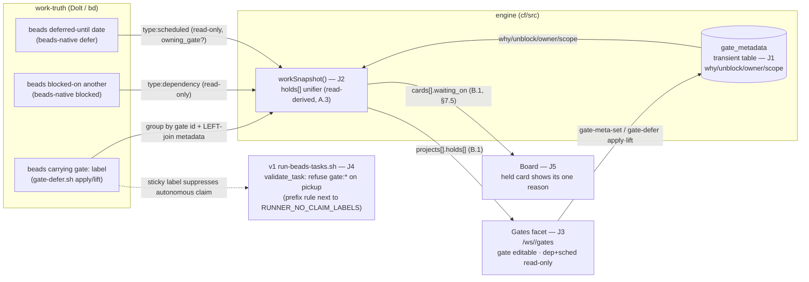

# DESIGN J — Gates: the unified Hold view

> Track J of the UX v2 overhaul. The **design** deliverable behind impl beads
> J1–J5 (`claude-tools-uxvj1..5`). Owns Flow J:
> [UX-DESIGN-V2 §7](../UX-DESIGN-V2.md) (Gates / the unified Hold view, B8/C3)
> built on the [Architecture Spine](../UX-V2-ARCHITECTURE.md) contracts **A.2**
> (storage class — `gate_metadata` is transient), **A.3** (projection-field
> rule — `holds[]` is read-derived), **B.1** (`work-snapshot` projection),
> **B.4** (render tolerance), **C** (app-shell + `/ws/<ref>/gates` route),
> **D.1** (the Hold/Gate/Checkpoint noun split), **D.2** (closed enums:
> `holds[].type`, the Gate object, runner-respect).
>
> **Read the spine first.** This doc conforms to it. Where it refines the spine
> or chooses between two workable shapes it says so and cites the code the
> choice is grounded in. It never re-overloads "gate" (must-protect #6), never
> tries to change beads' native `blocked`/defer (the C3 honesty constraint), and
> never re-specs the `gate-defer.sh` cohort mechanic it builds on — it points at
> it and adds only the metadata + projection + runner-respect seam.

---

## 0. The one-paragraph shape

Three different mechanisms hold a ready-looking task today, and only one of them
is ours to edit. **Dependency** holds (`blocked`) and **Scheduled** holds (a
defer date) are **beads-native — we read them, we cannot change them** [C3]. The
third, a **Gate**, is *our* native hold: the `gate:<id>` bd label that
`gate-defer.sh` already stamps and lifts as a cohort. Track J does three things
on top of what exists. (1) It gives the bare `gate:<id>` label the **metadata
Brian asked for** — `why`, `unblock_condition`, `owner`, `scope` — in a
**transient** `gate_metadata` table keyed to the gate id (J1). (2) It **unifies**
all three hold types into one read-time-derived `holds[]` array inside
`workSnapshot()`, so "what's blocked / what's deferred / what's gated" is one
join, never three places (J2). (3) It makes the **runner refuse** a task
carrying any `gate:*` label on pickup — the realization of Brian's "the runner
respects them" — as a small prefix rule next to the existing
`RUNNER_NO_CLAIM_LABELS` block on the v1 runner (J4). The UI renders all three
together with **only Gates editable** (J3), and the Board surfaces each held
card's one reason inline (J5). The honesty rule throughout: a Gate is fully
editable because it's ours; Dependency and Scheduled are shown read-only with
their native unblock condition and an honest "beads-native" note.



---

## 1. Vocabulary — the collision this fixes  [conforms D.1 / UX-DESIGN-V2 §7.1]

The code already overloads "gate" two ways — `gate-defer.sh` (the cohort/release
gate, `gate:<id>` label) and `gate-policy.sh` (the pickup-time **Checkpoint**,
`preset:*` label). `agents/gate-defer.md:42-53` documents the collision as a
hazard. The spine's D.1 fixes the **user-facing** words; this track owns making
them real. Binding for every J surface:

| User word | Means | Backed by | Editable in GUI? |
|---|---|---|---|
| **Hold** | umbrella: *any* reason a ready-looking task isn't worked | presentation only (the `holds[]` array) | — |
| → **Dependency hold** | blocked on another task | beads-native `blocked` — **read, can't change** [C3] | **no** (read-only + native note) |
| → **Scheduled hold** | deferred to a date | beads-native defer — **read, can't change** [C3] | **no** (read-only + native note) |
| → **Gate** | a *named* hold w/ why + unblock, GUI-add/removable, agent-read/writable, runner-respected | **our `gate:<id>` label** + `gate-defer.sh` + the new `gate_metadata` | **yes** — the only editable hold |
| **Checkpoint** | a lifecycle decision point (old "GATE (you)") — produces a *decision*, not a hold | `preset:*` + `gate-policy.sh` | (out of scope for J) |

**Gate ≠ Checkpoint.** Keep the internal code names (`gate-defer.sh`,
`gate-policy.sh`); the UI only ever says Hold / Gate / Checkpoint. The single
rule that catches the most bugs (must-protect #6): no J copy re-uses "gate" for
the pickup Checkpoint, and no J surface presents a Dependency/Scheduled hold as
if it were editable.

---

## 2. `gate_metadata` — the metadata the bare label lacks  [J1 · claude-tools-uxvj1]

### 2.1 Storage class: transient, keyed to the label  [A.2]

The spine already classified it (A.2 table): `gate_metadata` is a **transient**
sibling-namespace table, **not** a §4 record. It *annotates* a beads-label, has
no independent `(type,id)` lifecycle, and is **read by join** — never appears in
a notification body. The precedent module is `cf/src/machine-state.js`
(lazy-DDL'd, `INSERT OR REPLACE`, bypasses `_writeRecord`/`validateRecord`,
absent from `schema.js`'s §4 registry). J1 mirrors it in a new
`cf/src/gate-meta.js`.

The table is keyed by the **bare gate id** — the `<id>` in `gate:<id>` — matching
`gate-defer.sh`'s `_is_valid_gate_id` shape (`^[a-z0-9][a-z0-9-]*$`,
`gate-defer.sh:77-80`). The `gate:` prefix is the *label namespace*; the table
key is the id alone, so a single row serves the whole cohort that carries the
label.

```sql
-- cf/src/gate-meta.js — lazy DDL (machine-state.js:67-76 pattern)
CREATE TABLE IF NOT EXISTS gate_metadata (
  gate_id           TEXT NOT NULL PRIMARY KEY,  -- the <id> in gate:<id>
  why               TEXT,                        -- free text (B8: "a why")
  unblock_condition TEXT,                        -- free text or a ref (B8: "what would unblock")
  owner             TEXT,                        -- "you" | "agent:<hat>"  (see 2.3)
  scope             TEXT,                         -- "task" | "cohort"      (D.2 enum)
  set_at            TEXT NOT NULL,               -- first placement (preserved across edits)
  updated_at        TEXT NOT NULL                -- last edit
)
```

The Gate object the projection exposes is exactly D.2's
`{ id, why, unblock_condition, owner, scope: task|cohort }`, plus `set_at` for
the "set by you · 4d ago" line in §7.2's mock.

### 2.2 Ops: `gate-meta-set` / `gate-meta-get`  [A.1 / A.4]

Two ops, registered as a guarded set **before** the main `switch` in
`coordinator.js` (the `RECONCILE_OPS`/`handleReconcileOp` precedent at
`coordinator.js:277-279`):

```js
// coordinator.js — before the main switch
const GATE_META_OPS = new Set(["gate-meta-set", "gate-meta-get"]);
if (GATE_META_OPS.has(op)) return await handleGateMetaOp(this, op, args, principal);
```

- **`gate-meta-set(gate_id, {why, unblock_condition, owner, scope})`** — upsert.
  Validates `gate_id` against the same `^[a-z0-9][a-z0-9-]*$` regex
  `gate-defer.sh` enforces (so the label and the metadata can never disagree on
  what a legal id is). `set_at` is **preserved** on update (read the existing
  row; only `updated_at` advances) so "set 4d ago" stays honest across edits.
  Reject (422, empty body — `machine-state.js:245` posture) on a bad id or a
  `scope` outside `{task,cohort}`. Write goes through `co._serialize()` like the
  machine-state ingest.
- **`gate-meta-get(gate_id?)`** — read one row, or all rows when `gate_id` is
  omitted (the projection's bulk path; pure read, no `_serialize`, mirrors
  `getMachineStates`). Missing row ⇒ `null`, never a throw.

`gate-meta-set` is a **write op** and therefore passes the one §9.1 auth
chokepoint (`index.js:35-45`) exactly like every other write — the Worker has
already validated the bearer and resolved `principal` before the op runs.

### 2.3 `owner` is an input, not the principal — the non-obvious bit

The §7.3 requirement is that a Gate records **who** placed it and **which kind**
("an agent placed this"). The obvious move — derive `owner` from the request
principal — **does not work here**: the engine resolves a single constant
principal `PRINCIPAL_V1(env)` for every authenticated caller (`index.js:35-45`,
`coordinator.js:418` stamp). The bearer is shared by the GUI proxy and every
agent, so the principal cannot distinguish "you" from "agent:enricher".

Therefore `owner` is an **explicit input field** on `gate-meta-set`. The GUI
proxy passes `owner:"you"`; an agent placing a gate passes
`owner:"agent:<hat-id>"`. This is the honest realization of "every agent-placed
hold is visible *with its owner*" (the thirsty invisible-defer fix, §7.3) — the
visibility comes from the caller declaring itself, which is the same trust model
the rest of the work plane already uses. *Reversible:* if a per-actor principal
ever lands, `owner` can switch to principal-derived without changing the table.

### 2.4 The label stays the source of truth; metadata is annotation

`gate_metadata` does **not** own cohort membership. The `gate:<id>` **label** is
the source of truth for "which beads are held by gate X" — that is `gate-defer.sh`'s
existing contract (`gate-defer.md:30-34`, `_beads_for_gate` =
`bd list --label gate:<id>`). Consequences the design must respect:

- A metadata row with **no** beads carrying its label is **dormant**: the why/
  unblock persists (so re-applying the gate re-uses its reason) but it is **not**
  rendered as a live hold (a hold needs `task_count ≥ 1`).
- Lifting a gate (`gate-defer.sh lift --commit`) removes the **label** from every
  bead; the metadata row is left behind (transient, cheap). The hold disappears
  from `holds[]` the next snapshot because `task_count` drops to 0. No metadata
  delete op is required for v1 (a `gate-meta-clear` is a [free] later add if dorm
  rows ever need GC).
- Placing/lifting/cohort-membership all keep flowing through `gate-defer.sh`
  unchanged. J1 adds *only* the annotation; it does not re-implement apply/lift.

---

## 3. `holds[]` — the read-time unifier in `workSnapshot()`  [J2 · claude-tools-uxvj2]

### 3.1 Derived, never stored  [A.3 — the 56h rule]

`holds[]` is produced **at read time** inside `workSnapshot()`
(`reconcile.js:670`), joined into each entry of `projects[]` — never persisted.
This is the A.3 projection-field rule: the field the UI shows is named in B.1 and
emitted by `workSnapshot()`, full stop. It is added to the `projects.push({…})`
call at `reconcile.js:744-756`, alongside `runner_state` and `lease`, as a
**named sub-object** (`holds`) so it never collides with the `activity` /
`queue_health` / `blueprint_meta` keys the sibling tracks add to the same loop
(the §6 "each track owns a named sub-object" rule).

The emitted shape is B.1 verbatim:

```jsonc
"holds": [
  { "type": "gate", "id": "gate:audio-redesign", "task_count": 3,
    "owner": "you", "set_at": "…",
    "why": "…", "unblocks_when": "…", "editable": true },
  { "type": "dependency", "task_ref": "rhythmGame-77p",
    "blocked_on": "rhythmGame-77a", "unblocks_when": "77a closes",
    "editable": false },
  { "type": "scheduled", "task_ref": "rhythmGame-5kq",
    "deferred_until": "2026-07-01",
    "owning_gate": "gate:audio-redesign|null", "editable": false }
]
```

`type` is the closed D.2 enum `gate | dependency | scheduled`. `editable` is
`true` **only** for `gate` — the projection itself encodes the C3 honesty rule so
no UI agent can accidentally make a beads-native hold look editable.

### 3.2 The three derivations

All three read from the **work-truth `beads[]`** that `workSnapshot` already
parses (`reconcile.js:673-681`) — the same array the lifecycle columns and cards
are built from. The gate branch additionally LEFT-joins `gate_metadata`.

1. **`gate`** — scan `beads[]` for any label matching `gate:*`; group by gate id;
   `task_count` = beads carrying that label. For each gate id, `gate-meta-get`
   the row (one bulk read of `gate_metadata`, then an in-memory map — avoids N
   queries) → `why`, `unblock_condition`→`unblocks_when`, `owner`, `set_at`,
   `scope`. **Missing metadata degrades per B.4**: render the gate with
   `why:null, unblocks_when:null` and a `degraded[]` note ("gate placed before
   metadata existed"), never drop the hold or throw. `editable:true`.
2. **`dependency`** — beads flagged blocked with a `blocked_on` ref.
   `unblocks_when` is the honest native condition `"<blocked_on> closes"`.
   `editable:false`. (beads-native; we only read.)
3. **`scheduled`** — beads with a `deferred_until` date. `unblocks_when` = that
   date. `owning_gate` = the `gate:<id>` label co-present on the **same** bead if
   any (the `gate-defer.sh` coupling: a defer set on behalf of a gate carries the
   gate label — `gate-defer.md:24-34`). This is what lets the UI nest a Scheduled
   hold **under its Gate** (§7.2) and show that lifting the gate clears the defer.
   `editable:false`.

### 3.3 The producer must carry three fields it doesn't today  [A.3 applied to the source]

`holds[]` needs, per work-truth bead: **`labels[]`** (to find `gate:*`),
**blocked-status + `blocked_on`**, and **`deferred_until`**. The current
`card(b)` builder maps `bead_ref/title/stage/priority/age/waiting_on/failure`
(`reconcile.js:857-865`) — i.e. the work-truth beads are **already enriched
beyond bare `bd` output** (failure metadata, `waiting_on`). J2 extends that same
enrichment with the three hold fields wherever the work-truth `beadsStr` is
assembled before it reaches `work-snapshot` (the daemon-side `bd` read that
posts the snapshot input; note the `pages-dev/adapter.js:58` dev path passes an
empty `beadsStr`, so the enrichment is a producer-side concern, not the adapter's).

The concrete `bd` sources the producer maps from (each already used elsewhere in
the runner, so none is new ground): **labels** from `bd label list <id> --json`
(the call `validate_task` already makes, `run-beads-tasks.sh:662`); **blocked /
`blocked_on`** from `bd blocked --json` (the blocked-id set `validate_task` reads
at `:680`) joined with the bead's dependency edges (`bd show <id> --json`
`dependencies`/`blocked_by`) for the specific blocking ref; **`deferred_until`**
from the bead's `Deferred:` field (what `gate-defer.sh:_defer_of` reads via
`bd show`, `gate-defer.sh:103-107`; the `--json` equivalent if present). `bd`'s
JSON field names are notoriously inconsistent (the runner already defends against
`issue_type` vs `type`, array-vs-object wrapping — `run-beads-tasks.sh:690-712`),
so J2 confirms the exact JSON path at impl and falls back tolerantly per B.4.
**This is the 56h trap in miniature:** if the producer doesn't carry `labels` /
`blocked_on` / `deferred_until`, the unifier can never see them and the Gates
facet renders empty no matter how correct the join is. J2's live-verify must
assert a seeded `gate:<id>` bead actually appears in `holds[]` end-to-end, not
just that the join function works in isolation.

### 3.4 Scope: per-project, with a global rollup

`holds[]` lives in `projects[]`, so it is **per-project**. The primary path is
the per-workspace call (`/ws/<ref>/gates`, `proj` set at `reconcile.js:690`):
`beads[]` is that workspace's work-truth and `holds[]` is built from it. The
**global Gates rollup** (§7.2 "also a global rollup") aggregates per-project —
the same way the Workspaces hub already iterates `projects[]` — rather than
forcing every bead to carry a `project_ref`. This keeps J2 scoped to the existing
single-project read shape; the rollup is a UI-side concatenation of per-project
`holds[]`. *Reversible:* a future multi-project `beads[]` (each tagged with its
project) would let one snapshot build all rollups, but it isn't needed for v1.

---

## 4. The Gates facet UI  [J3 · claude-tools-uxvj3 · conforms §7.2/§7.3, Contract C]

Route `/ws/<ref>/gates` (Contract C.2 workspace facet; blocked-by `C-shell`,
`claude-tools-uxvsh`, already done). A pure `deriveGatesView(snapshot, now, opts)`
UMD module + thin `app.js`, following the `board-view.js` template (C.1). It
reads **only** `projects[].holds[]` from B.1 — nothing the projection doesn't
promise (must-protect #2).

Rendering rules (the §7.2 mock is normative):

- **All three hold types in one list per workspace**, grouped `HELD IN <ws>`.
  Each row carries its type glyph + the unblock condition.
- **Only `type:"gate"` rows are editable.** Gate rows expose `[ lift gate ]`
  `[ edit why ]` `[ edit unblock ]`. The lift runs `gate-defer.sh lift --commit`
  **on the host** — the web tier has no host access, so it goes through the
  **`agent-action gate-lift`** intent (frozen in [agent-action.md](agent-action.md),
  `claude-tools-uxcap`: the daemon polls the recorded intent and executes the `bd`
  mutation in the workspace). The `edit why`/`edit unblock` are pure engine writes —
  `gate-meta-set`, called **directly** (no host needed). **Dependency and
  Scheduled rows are read-only**, rendered with their native `unblocks_when` and
  the honest note `(beads-native — read-only)` / `(beads-native; gate-owned)`.
  The `editable:false` flag from the projection (3.1) is what the renderer keys
  on — it never decides editability itself.
- **A Scheduled hold with `owning_gate != null` renders *under* its Gate**, so
  lifting the Gate visibly accounts for the defers it owns (§7.2). This is the
  existing apply/lift mechanic surfaced, not a new one.
- **Add-a-Gate** affordance: a form that `gate-meta-set`s the why/unblock/scope
  (engine-direct) **and** places the label on the selected task(s) via the
  **`agent-action gate-apply`** intent ([agent-action.md](agent-action.md)) — the
  host runs `gate-defer.sh apply <gate> <bead> <date>`, which couples the `gate:<id>`
  label *with* a defer date (so the add-gate form supplies a date: the unblock date,
  or a far-future sentinel for "indefinite until lifted"). `owner:"you"`.
- **Tolerance (B.4):** a malformed/missing hold field → honest placeholder + a
  `degraded[]` note, never a blank row or a throw. The only refusal is the
  integer `schema_version` gate (the `inbox-view.js` `schemaGate` pattern).
- **[free]** (Contract C.3 / §8): glyphs, density, whether holds are grouped by
  type or by task, the lift-confirm affordance. None of it couples to another
  agent once it reads the B.1 shape.

**Web acceptance discipline (CLAUDE.md / bgw):** J3 is not done at commit — it is
done when the unified `claude-wrangler` Pages deploy serves the new bytes and
`verify-pages-deploy.sh` prints `mismatches=0`.

---

## 5. Runner-respect — refuse a gated task on pickup  [J4 · claude-tools-uxvj4 · §7.4, ARCH §9 dec.1]

### 5.1 Where it lands: v1, next to `RUNNER_NO_CLAIM_LABELS`

The spine's recommendation (ARCH §9 decision 1) is to land gate-respect on the
**v1 production runner** `run-beads-tasks.sh`, where the label-gate already lives,
rather than on the undeployed v2 `runner.sh`. This design **adopts that
recommendation** and is structured so that if Brian rules "v2 instead," only the
*placement* of the prefix check moves — the rule itself, the conformance
assertion, and everything in J1–J3/J5 are placement-independent. Per the I-design
precedent (`activity.md §5`, which made the identical call for I1/I5), this fork
is **already filed in the spine with a recommended answer and is not
re-litigated here**; J4's bead carries "confirm runner target," which is the
one-tap yes/no the spine flagged as the single item that blocks an impl bead. It
does not block this design doc.

### 5.2 A prefix rule, not a comma-list entry — the key refinement

The existing gate is an **exact-match** over `RUNNER_NO_CLAIM_LABELS`
(`run-beads-tasks.sh:660-676`, `grep -qxF`), with the default
`human-live-session,human-triage,human-action` (`:86`). A Gate label is
`gate:<id>` with a **dynamic suffix** — you cannot enumerate every gate in a
comma list, and adding the literal `gate:` would exact-match a label no bead
carries. So J4 adds a **dedicated `gate:`-prefix refusal** in `validate_task`,
sharing one **hoisted** label fetch with the `noj` block:

```bash
# Hoisted to the TOP of validate_task, above BOTH gates — one bd call, both
# gates always evaluated regardless of RUNNER_NO_CLAIM_LABELS. (Today the
# fetch lives INSIDE the noj `if` at :661-662; J4 lifts it out.)
local task_labels
task_labels=$(bd label list "$task_id" --json 2>/dev/null | jq -r '.[]?' 2>/dev/null || echo "")

#   …existing noj exact-match gate now reads the hoisted $task_labels…

# claude-tools-uxvj4 — Gate-respect. ANY label matching gate:* suppresses
# autonomous pickup (our native hold; Brian B8 "the runner respects them").
# Prefix match, not exact — gate ids are dynamic (gate:audio-redesign, …) and
# cannot live in the exact-match RUNNER_NO_CLAIM_LABELS list. Always-on, so it
# runs even when RUNNER_NO_CLAIM_LABELS is empty. Skip-not-fail, same posture
# as the noj gate: no FAILED++, no incident — the bead stays open-and-ready for
# the human to lift the gate from the Gates facet.
if printf '%s\n' "$task_labels" | grep -qE '^gate:[a-z0-9][a-z0-9-]*$'; then
  local g; g=$(printf '%s\n' "$task_labels" | grep -m1 -E '^gate:')
  echo "  Skipping: gate label '$g' present (runner respects Gates — lift it from the Gates facet)"
  return 1
fi
```

- **Always-on**, independent of `RUNNER_NO_CLAIM_LABELS` — a Gate is *our* native
  hold mechanism, not an optional per-project fixture label, so respecting it is
  not opt-in. (`RUNNER_NO_CLAIM_LABELS` stays exactly as-is for the exact-match
  human-* fixtures.) A `RUNNER_RESPECT_GATES=0` escape hatch is a cheap [free]
  add if an operator ever needs it, but the default and recommendation is on.
- **Skip-not-fail**, matching the `noj` posture (`:651-655`): no `FAILED++`, no
  retry tracking, no incident. The bead stays open-and-ready; only the human (or
  the agent that placed it) lifts the gate. The label is sticky across `bd`
  reloads and the runner cannot lift it itself — the same durability argument
  `noj` makes (`:656-659`).
- **It shares one `bd label list` fetch with the noj gate — but that fetch must
  be hoisted, not reused-in-place.** Today `task_labels` is assigned *inside* the
  `noj` `if [[ -n "${RUNNER_NO_CLAIM_LABELS:-}" ]]` block (`:661-662`), so it is
  unassigned whenever that env var is empty. Because the gate rule is always-on,
  naively reading the noj-block variable would **silently no-op the gate** when
  `RUNNER_NO_CLAIM_LABELS=""` (the exact failure J4 exists to prevent). J4 lifts
  the single fetch above both gates; one `bd` call serves both, and the gate is
  evaluated unconditionally. This hoist is the one structural change J4 makes to
  the noj block.

### 5.3 ir7 self-mod discipline + conformance

J4 edits `run-beads-tasks.sh` — the script the runner is **executing** (the ir7
self-modification hazard the spine names in §9 dec.1). Discipline: make the
change as a normal reviewed edit + commit (not a live in-loop self-edit), and let
the next runner start pick it up; do not hot-patch a running loop.

**Conformance assertion** is mandatory (J4's bead). Add **BC-08c** as a sibling
of the existing `conformance/assertions/bc-08b-no-claim-label-gate.sh` (which
already proves the exact-match human-* gate). BC-08c seeds a bead carrying
`gate:audio-redesign`, runs the runner with no other ready work, and asserts the
`bc-08b` invariant set for the gate case:

- bead stays `open` (never claimed), no `in_progress`/`closed` audit transition;
- the skip message naming the matched `gate:` label is printed;
- **no incident logged** (skip-not-fail);
- **anti-regression:** an *unlabelled* bead, and a bead with a *non-gate* label
  (e.g. `gateway`), are still claimed normally — the prefix must not over-match
  (the `^gate:` anchor + the id-shape suffix guard against `gateway`/`gate-foo`
  false positives).

This is the same SCAR the `bc-08b` header documents (a runner re-claiming a
human-only fixture burns per-dossier spend) applied to Gates.

---

## 6. Who can do what + the agent-gate FYI  [§7.4 / §10]

| Actor | Can | Via |
|---|---|---|
| **Brian (GUI)** | add a Gate; set/edit why + unblock; lift a Gate; see all holds | the Gates facet (J3) → `gate-meta-set` + `gate-defer.sh apply/lift` |
| **Agents** | place a Gate with a why + unblock; read existing Gates before deciding | `gate-defer.sh apply` + `gate-meta-set owner:"agent:<hat>"`; read via `gate-meta-get` |
| **The runner** | refuse to pick up any `gate:*`-labelled task | the §5 prefix rule in `validate_task` |

**Placement authority** follows the spine's assumed answer (§9 dec.2 / §14.1):
**any agent** may place a Gate; the safeguard is not *who* but that **every
placement is visible** on the Gates facet and **FYI'd if it holds significant
work**. This is the thirsty fix — today agents defer invisibly; v2 requires an
agent that holds work to place a Gate *with a why*, and that placement surfaces.
Not a fork (the spine already assumes it); adopted here.

**The agent-gate FYI** (§7.4 "an FYI on the Inbox", §10):

- **Trigger:** an agent (`owner` matches `agent:*`) places a Gate via
  `gate-meta-set` that holds **significant** work. v1 "significant" =
  `scope:"cohort"` **or** the gate holds a bead that was otherwise ready/next-up
  (it changes what the runner would do). A single-task gate on already-held work
  is visible on the facet but does not ping.
- **Tier:** `timed-fyi`, **batched** — never `blocking`. Batching is
  load-bearing (must-protect #5): a burst of agent-placed gates must roll up, not
  fire N pings. **The emit seam J owns** is a single `notification` record (the
  §4 `notification` record type, A.2) stamped `tier:"timed-fyi"`, registered as
  one entry in Track N's trigger catalog (N1, §10.2). **The batching/rollup J
  reuses** is the already-shipped K3 read-side digest (`notif-digest` / the
  `no_digest` flag, commit `5365932`) shared with N1 (§10.3) — J does **not**
  build its own batcher, and it never emits a `blocking` tier. The exact cadence
  and the "significant" threshold are [free] (§8 / §14), tuned from data.
- **Body:** "agent:<hat> placed gate:<id> (why: …) holding <n> task(s);
  unblocks when …" — the why and unblock come straight from the metadata, so the
  FYI is never a contentless "something was held."

This closes the "you didn't tell me about the blocker" / invisible-defer class
(D.3 principle: *Nothing is held invisibly* — every hold has why+unblock and, if
significant, announces itself).

---

## 7. Board "waiting on" inline  [J5 · claude-tools-uxvj5 · §7.5]

Every held Board card shows *which* hold and its unblock condition inline, so the
Board never shows a stalled task without saying why — directly answering the
thirsty "why is `bd ready` empty / showing only epics" without Brian asking an
agent.

The grounding is cheaper than it looks: the card builder **already emits**
`waiting_on: b.waiting_on ?? null` (`reconcile.js:863`). Today that passes through
whatever the runner happened to stamp on the bead. J5 changes the **source**:
`waiting_on` is derived from the **same `holds[]`** computed in §3 — for a card
whose bead is held, set `waiting_on` to that bead's hold (`{type, unblocks_when}`,
and `gate_id`/`task_ref` as appropriate) — instead of relying on a runner-stamped
field. One bead can be under multiple holds (a gate *and* a dependency); v1 shows
the **most-actionable one** with a deterministic precedence
`dependency > gate > scheduled` (a hard block outranks a chosen gate outranks a
date), and the card may carry a `+N more` affordance ([free]). Same data as the
Gates facet, surfaced inline — no second projection.

`waiting_on` is already a promised B.1 `cards[]` field (§7.5: "each gains
`waiting_on`"), so J5 is a derivation change inside `workSnapshot`, not a new key.
B.4 tolerance: no hold ⇒ `waiting_on:null` ⇒ the card renders without a waiting
line (honest: not held). Web acceptance = the bgw `mismatches=0` deploy gate.

---

## 8. Contract conformance checklist (the must-protect lens)

| Spine item | How Track J conforms |
|---|---|
| **A.2** storage class | `gate_metadata` = **transient** (annotates a label, no §4 lifecycle, read by join; `machine-state.js` precedent); absent from notification bodies |
| **A.3** projection-field rule | `holds[]` + `cards[].waiting_on` **derived in `workSnapshot()`**, never stored; producer carries `labels`/`blocked_on`/`deferred_until` or the field can't show (§3.3 — the 56h trap, asserted in live-verify) |
| **B.1** projection shape | emits `projects[].holds[]` verbatim (3-type closed enum, `editable` flag) + `cards[].waiting_on`; named sub-object so no collision with `activity`/`queue_health` |
| **B.4** tolerance | missing metadata / malformed hold → honest placeholder + `degraded[]`; only refusal is the integer schema-gate; never re-add a render refusal |
| **C** app-shell | `/ws/<ref>/gates` facet, `deriveGatesView` UMD + thin `app.js` (board-view template); blocked-by `C-shell` |
| **D.1** noun split | Hold/Gate/Checkpoint kept distinct in all copy; only Gate editable; Dependency/Scheduled read-only w/ honest native note (must-protect #6) |
| **D.2** closed enums | `holds[].type` = `gate\|dependency\|scheduled`; Gate object = `{id,why,unblock_condition,owner,scope:task\|cohort}`; runner-respect = `gate:*` suppression |
| **C3 honesty** | beads-native `blocked`/defer are **read, never changed**; `editable:false` encoded in the projection so no UI can fake-edit them |
| must-protect #1 (bgw) | J1/J2 engine live-verify; J3/J5 close only on `mismatches=0` Pages deploy |
| must-protect #5 (45 pings) | agent-gate FYI is `timed-fyi`, **batched** via the shared K3/N1 spine — never per-placement blocking |
| **D.3** *Nothing held invisibly* | every Gate has why+unblock; agent placement of significant work FYIs |

---

## 9. Impl split — beads J1–J5

The impl beads already exist under epic `claude-tools-mhcp`; this doc is their
design of record. Anchors below are the binding design reference for each.

| Bead | Scope | Design anchor | Track-type / gate |
|---|---|---|---|
| **J1** `uxvj1` | `gate_metadata` transient table + `gate-meta-set`/`-get` ops (why/unblock/owner/scope) | §2 | engine (Contract A.2) — **live-verify engine** |
| **J2** `uxvj2` | `holds[]` unifier in `workSnapshot()` (3 mechanisms, read-derived); producer carries labels/blocked_on/deferred_until | §3 | engine (Contract B.1) — **live-verify engine** (seeded gate appears end-to-end) |
| **J3** `uxvj3` | Gates facet UI: add/edit/lift gate; deps+scheduled read-only; scheduled-under-its-gate | §4 | **web** (Contract C) — **Pages-verify `mismatches=0`** |
| **J4** `uxvj4` | runner refuses `gate:*` on pickup (prefix rule, v1); ir7 discipline; BC-08c assertion | §5 | runner — conformance assertion; **depends ARCH §9 dec.1** |
| **J5** `uxvj5` | Board `cards[].waiting_on` derived from `holds[]` (held card shows its one reason) | §7 | **web** (Contract C) — **Pages-verify `mismatches=0`** |

**Dependency notes** (mirror the bead graph):

- **J2 ⟶ J1** — the unifier LEFT-joins `gate_metadata`, so the table+ops exist
  first.
- **J3 ⟶ J2 + `C-shell`** — the facet reads `holds[]`; all facet UIs are
  `--blocked-by C-shell` (`uxvsh`, done).
- **J4 ⟶ J1** — kill+gate / placing a gate with a why needs `gate_metadata`; J4
  also carries the **ARCH §9 dec.1** one-tap "v1 vs v2 runner" confirm (filed in
  the spine, recommended answer = v1; not re-asked here).
- **J5 ⟶ J2 + `C-shell`** — `waiting_on` is the same `holds[]` data, surfaced on
  the Board.
- **Cross-track:** J1 also unblocks I4 (`uxvi4`, stuck "kill+gate" action reuses
  `gate_metadata`) — sequence J1 before I4. The FYI in §6 rides Track N/K3's
  batching spine (reuse, not a blocking merge).

---

## 10. What's deliberately [free]

Per ARCH §8 — move fast, these don't couple to another agent once the
`gate_metadata` shape, the `holds[]` B.1 contract, and the `gate:*` prefix rule
hold:

- **Gates facet** glyphs / layout / density / grouping (by-type vs by-task), the
  lift-confirm affordance, the add-gate form ergonomics — all inside Contract C's
  tokens.
- The **agent-gate FYI cadence** and the precise "significant work" threshold
  (§6) — tune from data; a §14 open question, not a contract.
- The Board `waiting_on` **multi-hold precedence** display (the `+N more`
  affordance) — `dependency > gate > scheduled` is the v1 default, refinable.
- Op/table **names within the flow** before it ships (`gate-meta-set`, the
  `gate_metadata` columns) — A.4 says rename freely pre-ship; match the existing
  set so review stays mechanical.
- A `gate-meta-clear` GC op for dormant rows, and a `RUNNER_RESPECT_GATES=0`
  escape hatch — both cheap later adds, neither needed for v1.
