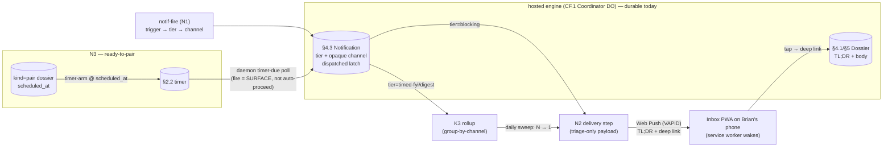

# DESIGN N — Notifications: delivery, ready-to-pair, trigger-catalog review

> Track N of the UX v2 overhaul. The **design** deliverable behind impl beads
> **N1** (`claude-tools-uxvn1`, the §10.2 trigger catalog — **done**), **N2**
> (`claude-tools-uxg1`, phone **delivery**) and **N3** (`claude-tools-uxg6`,
> **ready-to-pair**). Owns the notification half of
> [UX-DESIGN §5 principles](../UX-DESIGN.md) + [UX-DESIGN-V2 §10](../UX-DESIGN-V2.md)
> (the trigger catalog / batching) built on the
> [Architecture Spine](../UX-V2-ARCHITECTURE.md) contracts **D.2** (notification
> tiers), **A.2** (storage class), and the must-protect lens (esp. **#5** —
> batching is load-bearing).
>
> Track N never got a design bead until now, and N1 shipped the **trigger
> catalog only** — it routes a trigger to a tier and stamps a batching channel,
> but **nothing reaches Brian's phone** and ready-to-pair was punted to "plain
> blocking, scheduling beyond the spine." This doc closes both, and reviews N1's
> wiring against the canonical §10.2 catalog.
>
> **Read the spine first.** This doc conforms to it. It does **not** re-spec the
> §4.3 Notification record (T5.6 `lib/notification.sh` / CF.9 `cf/src/notification.js`
> — frozen INTERFACE §4.3), the **K3** digest-rollup engine it shares
> (`design/cross-ws.md` §4), the **§2.2 timer** it reuses for scheduling
> (`cf/src/timer.js`), or the ask-brian dossier-publish-and-block path
> (`mcp-askbrian/`). It points at each and adds only the delivery and
> scheduling seams.

---

## 0. The one-paragraph shape

A notification today is a **durable record that pages no one.** N1/CF.9 emit one
terse §4.3 row per dossier, mirror the dossier's §4.1 `tier`, and — for a
batchable trigger — stamp an opaque `channel` so the K3 rollup can group it. The
`dispatched` latch flips `false→true` and **sends nothing** (C3 deferred the
transport: `notification.js:46-48`). So the attention-router collapses to *"Brian
must remember to open the Inbox"* — the single most load-bearing capability is
missing. **N2** closes that: the Inbox PWA becomes an installable, Web-Push
surface, and a Worker delivery step turns a dispatched notification into a
**triage-only push** (TL;DR + a deep link to the dossier — never content,
principle 2). Tier drives the cadence: **`blocking` → one immediate push**;
**`timed-fyi`/`digest` → folded into the K3 daily digest (N pending → 1 push),
never N pings** (must-protect #5). **N3** realizes the reserved `kind:"pair"`
seam (INTERFACE §4.1) so **ready-to-pair** is a *scheduled collaborative-stage
session* — a `scheduled_at` appointment armed on the **§2.2 timer**, surfaced in
the Inbox as a distinct *"ready to pair on X"* mode (not *"decide X"*), promoted
to foreground at its time — restoring the "scheduled session" nuance N1 flattened
to plain `blocking`.

---

## 1. Where N1 left it — the trigger catalog, reviewed against §10.2

N1 (`uxvn1`) is **done and faithful.** The closed §10.2 catalog
(UX-DESIGN-V2 §10.2) lists **exactly ten** triggers; N1 wires **exactly those
ten** (`notification.js:273-284` / `notification.sh:611-626`), each bound to its
catalog tier with the producer-side batching spine (`notif-fire`). The review
result: **10/10 present, tiers 9/10 faithful, one deliberate punt to restore.**

| # | §10.2 catalog (UX-DESIGN-V2 §10.2) | catalog tier | N1 wired tier | channel | verdict |
|---|---|---|---|---|---|
| r1 | New decision dossier | blocking | `blocking` | — | ✅ |
| r2 | Blueprint materially changed | timed-fyi | `timed-fyi` | `blueprint:` | ✅ |
| r3 | Cross-workspace exchange | timed-fyi, **batched** | `timed-fyi` | `xws:` (K3-owned) | ✅ |
| r4 | Cross-workspace conflict / missing design | blocking | `blocking` | — | ✅ |
| r5 | Task **maybe stuck** | timed-fyi **or** blocking (failure→tier map) | `[timed-fyi, blocking]` | `stuck:` | ✅ |
| r6 | Runner wedged / starved | blocking (systemic) | `blocking` | — | ✅ |
| r7 | Intake failing / gave up | timed-fyi | `timed-fyi` | `intake:` | ✅ |
| r8 | Queue-health alarm | timed-fyi | `timed-fyi` | `queue:` | ✅ |
| r9 | Agent placed a Gate holding significant work | timed-fyi | `timed-fyi` | `agent-gate:` | ✅ |
| r10 | **Ready-to-pair (collaborative stage)** | **blocking-ish (scheduled session)** | `blocking` | — | ⚠️ **flattened** |

**The one gap (r10).** The catalog tier for ready-to-pair is *"blocking-ish
**(scheduled session)**"*. N1 flattened it to plain `blocking`, with the
in-code admission *"the scheduling nuance is beyond this spine"*
(`notification.sh:622-623`). That is correct as far as N1's spine goes — a
trigger→tier table has nowhere to put an appointment — but it means
ready-to-pair currently fires as an *undifferentiated immediate decision*, not a
*scheduled session*. **Restoring the scheduled-session semantics is N3 (§4).**
No other trigger is mis-tiered, missing, or extra; the catalog is closed and
N1 honors it (off-catalog triggers reject — D.2).

> **Why the channel prefixes are [free].** `xws:` is K3-owned and reused
> verbatim; `blueprint:`/`intake:`/`queue:`/`agent-gate:`/`stuck:` are [free]
> grouping namespaces (one per trigger family). They are opaque tags the rollup
> groups on — never interpreted by the producer — so renaming one before ship is
> mechanical (ARCH A.4). N2 (§2) does **not** depend on the prefix *spelling*,
> only on the tier and the presence/absence of a channel.

---

## 2. Delivery — the real gap  [N2 · `claude-tools-uxg1`]

### 2.1 The gap, stated honestly

There is **no push-to-phone transport anywhere in the repo.** What exists, and
what each actually does:

| Thing | What it does | Reaches Brian's phone? |
|---|---|---|
| §4.3 `dispatched` latch (`notification.{sh,js}`) | flips `false→true`, stamps opaque `channel` — *"it SENDS NOTHING"* (`notification.js:46-48`) | ❌ a flag, not a send |
| `emit_and_dispatch` (`mcp-askbrian/helpers/engine-bridge.sh:72-87`) | `no_emit` + best-effort `no_dispatch` latch flip; comment: *"a later sweep can flip the latch"* | ❌ latch only |
| ask-brian "Step 3: NOTIFY" (`mcp-askbrian/server.mjs:785`) | = `emit_and_dispatch`; then the worker **polls** the engine for Brian's answer (≤6h) | ❌ the worker waits; Brian is not pinged |
| `notify_user` osascript (`run-beads-tasks.sh:1279-1288`) | `\a` bell + `display notification` on the **operator's Mac** for runner-ops errors | ❌ wrong device, not wired to dossiers |
| Inbox PWA (`web/inbox/`) | **pull-only** page — no `manifest`, no service worker, no push subscription | ❌ Brian must open the URL |

The architecture is silent on transport by design: ARCH **D.2** names the tier
enum but specifies no delivery mechanism, and §9 lists only the digest *cadence*
as [free]. The one architectural anchor is **ARCH line 283** — *"The Inbox stays
the product (carried): **the only push surface**; everything else is pull."* That
is the whole design constraint: delivery's job is to **ring exactly one surface —
the Inbox — and get Brian to open it**, carrying only triage. Not a new pager, not
content on the wire.

### 2.2 The mechanism — Web Push to the installed Inbox PWA

The Inbox is already a Cloudflare Pages app. The grounded, zero-new-vendor
transport is **Web Push (VAPID)** to the Inbox installed as a home-screen PWA
(iOS 16.4+ and Android support Web Push for installed PWAs). This is preferred
over an external pager (Pushover/Telegram/SMS/email) because (a) it adds **no
external vendor, account, or per-message cost** — VAPID is a self-generated key
pair; (b) it rings **exactly the one push surface** ARCH line 283 mandates,
rather than introducing a second surface that contradicts it; (c) the push
**deep-links straight into the dossier** in the same app Brian resolves it in.
N2 has three parts:

1. **PWA-enable the Inbox** (`web/inbox/`): add `manifest.webmanifest` (name,
   icons, `display:standalone`, `start_url`) + a service worker registered from
   `app.js` that handles the `push` event (show a notification) and
   `notificationclick` (focus/open the deep link). A one-time permission prompt
   ("Allow Beads to notify you") on first install captures the
   `PushSubscription`. This is a **web bead** — bgw discipline applies (§5,
   `verify-pages-deploy.sh` against the live host; not done on local-green).

2. **Store the subscription server-side.** A new **transient** subscription
   record (A.2 storage class — *not* a §4 record; it is delivery plumbing, not a
   user-facing domain object): `{ principal, endpoint, p256dh, auth, created_at }`,
   keyed by principal. One Worker op pair (`push-subscribe` / `push-unsubscribe`)
   mirroring the smallest transient modules (the `relay.js` / `forensic.js`
   precedent K2 set). No INTERFACE §4.3 change — the Notification record is
   untouched.

3. **The delivery step** — a Worker `notif-deliver` that, given a dispatched
   notification, reads its `tier` + the dossier's TL;DR, and **POSTs a Web Push**
   (the `web-push` encryption + a `Bearer`/VAPID `Authorization` to the push
   endpoint) to every stored subscription. The payload is **triage only**:
   `{ tldr, dossier_ref, tier }` → rendered *"Decision: <TL;DR> — tap to open."*
   It **never carries the §5 body** (principle 2; the §4.3 closed-set discipline
   extended to the wire). The latch stays the idempotency guard — deliver fires
   off the `false→true` transition, exactly once.

### 2.3 Tier drives cadence (D.2 + must-protect #5) — the load-bearing rule

Delivery is **not "push every dispatched notification."** It keys off the tier,
the same split K3 already enforces on the read side:

- **`blocking`** (real decision; D.2 "blocks the pipeline, no auto-proceed") →
  **one immediate, individual push.** new_dossier, cross_ws_conflict,
  runner_wedged, a blocking task_maybe_stuck, and a surfaced ready-to-pair
  (§4) each ping the moment they dispatch.
- **`timed-fyi` / `digest`** (read-mostly / informational; auto-proceeds on
  silence) → **never an individual push.** They flow into the **K3 daily-digest
  sweep** and deliver as **one** push: *"6 syncs today — all resolved, none
  needed you. Tap to skim."* This is must-protect #5 (*"Always FYI becoming 45
  pings … batching is load-bearing"*) realized end-to-end: N1 batches at
  production, K3 rolls up at read, **N2 delivers the rollup as one push, not N**.

The **daily digest sweep** is a new daemon job riding the existing daemon clock
(`daemon.sh` already runs configurable-cadence polls; §3): once per cadence it
calls `notif-digest` (the K3 rollup), and for each non-empty channel group
delivers **one** digest push. A `blocking` notification is *never* swept (K3's
engine excludes it — double safety, `notification.js:130-131`). The cadence
itself is [free] (ARCH §9 "assumed daily").

### 2.4 Reversibility — the opaque channel keeps transport pluggable

Web Push is the spine pick, but the §4.3 `channel` tag is opaque and
already-present, so an **alternative or additional transport is a pure add** with
**no schema change**: a future `notif-deliver` can branch on a `channel`
convention (`email:…`, `telegram:…`, `pushover:…`) the same way K3 branches on
`xws:`. Choosing Web Push first commits nothing irreversible — it is the
best-grounded default (ARCH line 283 + zero vendor), and the delivery step is the
single place a second transport plugs in later. **No new external contract is
frozen by N2.**

### 2.5 Live-verify before close (the bgw/2dk lens)

uxg1 already mandates it: *"Live-verify against a REAL device/channel, not a
local stub."* N2 closes only when a real notification dispatched on the hosted
engine produces a **real Web Push on a real installed Inbox PWA** (the web leg
also passes `verify-pages-deploy.sh` → `mismatches=0`). A passing local stub is
the bgw failure — forbidden.

---

## 3. Batching (K3) is the shared spine — confirmed

K3 (`uxvk3`, `design/cross-ws.md` §4) is **the** batching spine, and it is
already the shared one: *"K3 owns the cross-WS `channel` convention + the rollup
copy; N1 owns the general group-by-channel-and-roll-up engine"* — built **once**
in the shared notification read path (`groupDigests`/`no__group_digests`), reused
verbatim by N1 for the whole trigger catalog. N2 is the **third consumer** of the
same spine and adds nothing to it: it calls the existing `notif-digest` rollup
and delivers its output. The invariant the three share — **`blocking` is never
batched; only `timed-fyi`/`digest` roll up** — is enforced in one place (the
`DIGEST_TIERS` exclusion) and N2 inherits it. There is no second batching path,
no per-track rollup. §10.3 (*"N pending → 1 digest"*) is honored at production
(N1), read (K3), and now delivery (N2).

---

## 4. Ready-to-pair — a scheduled collaborative-stage session  [N3 · `claude-tools-uxg6`]

### 4.1 What it is (and is not)

Flow A names **two** first-class interaction modes (UX-DESIGN §4): *"**Autonomous-
until-stuck** — the default workhorse,"* and *"**Collaborative stage** — you
explicitly want to be *in* a stage … This is a different touchpoint from a
dossier: it is **a scheduled working session**, surfaced in the Inbox as **'ready
to pair on X' rather than 'decide X.'**"* UX-DESIGN-V2 Flow A restates it: *"a
scheduled pairing session in the Inbox, **not a dossier**."* So ready-to-pair is
**not** a multi-Item decide dossier that happens to block — it is an **appointment
for a working session**. N1's plain-`blocking` flattening (§1, r10) loses exactly
this: the scheduling and the distinct Inbox affordance.

### 4.2 The seam is already reserved — realize `kind:"pair"`

INTERFACE **§4.1** already carries the discriminator: `kind` is an *"(open, C2
seam)"* enum — `"decide"` is implemented v1; **`"pair"` is "reserved, not
implemented"** (`INTERFACE.md:245`). N3 fills that reserved seam. A `kind:"pair"`
envelope is a **session card**, not a form: it carries the TL;DR of *what you'll
pair on* and a `scheduled_at`, but it is not iterated as §5 Items with response
affordances. Realizing a reserved open-enum discriminator is **not** a §11
INTERFACE amendment — it is exactly the extension the seam was left open for.

### 4.3 Scheduling — reuse the §2.2 timer, but fire = SURFACE, not auto-proceed

The scheduling primitive already exists and N3 rides it rather than inventing
one. The §2.2 one-shot timer (`cf/src/timer.js`: `timer-arm | timer-due |
timer-ack`, `timerArm(co, tid, fireAt)`) arms `fire(dossier_id)` at an RFC-3339
target and the daemon's `timer-due` poll is the S-6 fire-on-next-poll backstop
(`timed-fyi.sh` S-6). N3 adds a **`scheduled_at`** appointment time to the
`kind:"pair"` envelope and **arms the §2.2 timer at `scheduled_at`** (the same
`timer-arm` call `tf_arm` makes for `timer_fire_at`).

**The one critical difference from timed-fyi:** a timed-fyi timer fire
**auto-proceeds** — `tf_fire` applies each un-objected Item's consequence via the
§7.4 latch. A ready-to-pair fire must do the **opposite of auto-proceed**: it
**surfaces** the session (promotes it from *upcoming* to *ready-now* and fires the
`blocking` `ready_to_pair` notification, delivered by N2 §2). N3 therefore reuses
the timer **arm/due primitive** but **not** the `tf_fire` auto-apply handler — it
binds a distinct fire action ("surface + ping"). Nothing is consequence-applied
on silence; the whole point is to *get Brian into the session*, not to proceed
without him. (The §2.2 timer has no disarm; `timer-ack` is the stop-re-surfacing
primitive once Brian opens the session — `timer.js:172`.)

### 4.4 The Inbox mode

The Inbox already renders two modes off the tier (blocking "open and resolve" vs
timed-fyi "read-mostly, auto-proceeds" — `web/inbox/app.js`). N3 adds a **third
first-class mode** for `kind:"pair"`:

- **Before `scheduled_at`:** an **upcoming** card — *"Ready to pair on X — starts
  3:00pm"* — visually deferred (not a live blocker), so it doesn't read as a
  decision waiting *right now*.
- **At `scheduled_at`:** the timer fires → the card **promotes to foreground**
  and a `blocking`-tier push goes out (N2). The copy is *"ready to pair on X"*,
  not *"decide X"* — the Flow A distinction, made visible.

This is the "blocking-ish (scheduled session)" tier annotation from §10.2 r10,
realized: it delivers like a `blocking` ping **when its time comes**, but it is
scheduled and distinctly rendered, not an undifferentiated immediate decision.

### 4.5 What N3 leans on vs. owns

N3 **owns** the `kind:"pair"` realization, `scheduled_at`, the timer fire-action
("surface, not auto-proceed"), and the Inbox upcoming/ready mode. It **leans on**
N2 for the actual blocking ping (the session announcement is a `ready_to_pair`
notification, delivered by §2) and on the §2.2 timer + daemon clock for the
appointment. How the *collaborative session itself* runs (pairing live with an
agent on a stage) is the Flow A working-session mechanism and is **out of N3's
scope** — N3 delivers Brian *to* a scheduled, surfaced session; it does not
re-spec the stage-collaboration UX.

---

## 5. Contract conformance checklist (the must-protect lens)

| Spine item | How Track N conforms |
|---|---|
| **D.2** tiers | delivery keys off the closed enum: `blocking`→immediate push; `timed-fyi`/`digest`→batched digest push (§2.3). ready-to-pair surfaces at `blocking` *when scheduled* (§4.4) |
| **principle 2** (triage, never content) | the push payload is `{tldr, dossier_ref, tier}` + deep link — the §5 body stays in the dossier; the §4.3 closed set is extended to the wire (§2.2) |
| **principle 1** / **§10.3** (N→1 digest) | one digest push per channel group, never N pings; the K3 rollup is the single batching path N2 consumes (§3) |
| **must-protect #5** (45 pings) | batching is load-bearing end-to-end: N1 production + K3 read + **N2 one-push delivery** (§2.3) |
| **A.2** storage class | the push-subscription record is **transient** (delivery plumbing), not a §4 record; the §4.3 Notification is untouched (§2.2) |
| **INTERFACE §4.3** (no re-spec) | N2 reuses the `dispatched` latch + opaque `channel` — **no schema change** to the Notification record (§2.2, §2.4) |
| **INTERFACE §4.1** `kind` C2 seam | N3 realizes the reserved `"pair"` discriminator — an open-enum extension, not a §11 amendment (§4.2) |
| **§2.2 timer** (reuse, not reinvent) | ready-to-pair arms the existing `timer-arm`; binds a *surface* fire-action, not `tf_fire` auto-proceed (§4.3) |
| **ARCH line 283** (Inbox = only push surface) | delivery rings exactly the Inbox PWA; no second pager surface introduced (§2.2) |
| **bgw/2dk** web-track | N2's PWA leg + N3's Inbox mode close only on a verified Pages deploy + a **real device** push (§2.5) |
| D.2 closed-catalog (§1) | N1 reviewed 10/10 faithful; r10 scheduling restored by N3, not by widening the catalog |

---

## 6. Impl split — beads N1–N3

| Bead | Scope | Design anchor | Track-type / gate |
|---|---|---|---|
| **N1** `uxvn1` | §10.2 trigger catalog + producer batching spine (`notif-fire`) — **DONE**; reviewed faithful (§1) | §1 | **engine**; shares K3 |
| **N2** `uxg1` | **Delivery**: PWA-enable Inbox (manifest + service worker + Web Push) · transient push-subscription record + `push-subscribe`/`-unsubscribe` · `notif-deliver` (triage-only payload) · tier-keyed cadence (blocking immediate / fyi+digest via the K3 daily sweep) · daemon digest-sweep job | §2 + §3 | **engine + web**; **P1**; live-verify on a **real device** + Pages `mismatches=0` |
| **N3** `uxg6` | **Ready-to-pair** — **ENGINE + pure-view LANDED** (offline-green; `pair-arm`/`pair-surface` in `cf/src/timer.js` + `lib/timed-fyi.sh`, kind-routed timer-due poll, `kind:"pair"` lane visibility + `scheduled_at` in the §4.5 projection, the Inbox upcoming→ready third mode in `inbox-view.js`/`app.js`): realize `kind:"pair"` (C2 seam) · `scheduled_at` · arm §2.2 timer with a *surface* fire-action (not auto-proceed) · Inbox upcoming→ready mode · restores §10.2 r10's scheduled-session nuance. **Web deploy-verify (Pages `mismatches=0`) + the live blocking push remain — gated on N2 (`uxg1`) landing** (the push transport) + wrangler creds. | §4 | **engine + web** (Contract C); ⟶ **N2** (blocking ping) + §2.2 timer; Pages-verify |

**Dependency notes.** N1 is done. **N2 ⟶ DESIGN N** (this doc) — it is the spine
of the track (without delivery the attention-router does not function; uxg1 is
G1, top priority). **N3 ⟶ N2** (a surfaced pair-session announces via a delivered
`blocking` push) **and** the §2.2 timer; it is the lower-priority polish (uxg6 is
P2) that restores the Flow A scheduled-session UX N1 punted. Both already
`--blocked-by` `uxdn` (this doc) and the resumed `uxhold` freeze. The K3 rollup
engine (`uxvk3`) is the shared batching dependency for N2's digest cadence;
if K3 hasn't landed, blocking delivery still works — only the batched-digest leg
waits (degradable, not blocking).

---

## 7. What's deliberately [free]

Per ARCH §9 — these don't couple to another track once the tier-keyed cadence,
the triage-only payload, and the `kind:"pair"` surface-not-proceed fire hold:

- **Digest delivery cadence** (daily assumed) — ARCH §9 open question; tune from
  data without re-touching the mechanism (the daemon sweep interval is one env
  knob).
- **The push transport** — Web Push is the grounded spine pick, but the opaque
  `channel` keeps an added/alternative transport (`email:`/`telegram:`/
  `pushover:`) a pure plug-in with no schema change (§2.4). The *enum* of tiers
  is fixed; the *transport* is not.
- **Channel-prefix spellings** (`blueprint:`/`intake:`/`queue:`/`agent-gate:`/
  `stuck:`) — [free] grouping namespaces; match the existing set so review is
  mechanical (A.4). Delivery depends on the tier + channel *presence*, not the
  spelling.
- **The push copy / notification title + body wording** — the *enum* (triage
  only, deep link) is fixed; the exact one-liner is [free] to sharpen.
- **Ready-to-pair card density / "upcoming vs ready" visual treatment** inside
  Contract C's tokens; whether upcoming pair-cards sort into a separate Inbox
  lane or inline-with-a-time.
- **PWA niceties** (icon set, install-prompt timing, badge counts) beyond the
  manifest + service worker + subscription minimum N2 ships.
